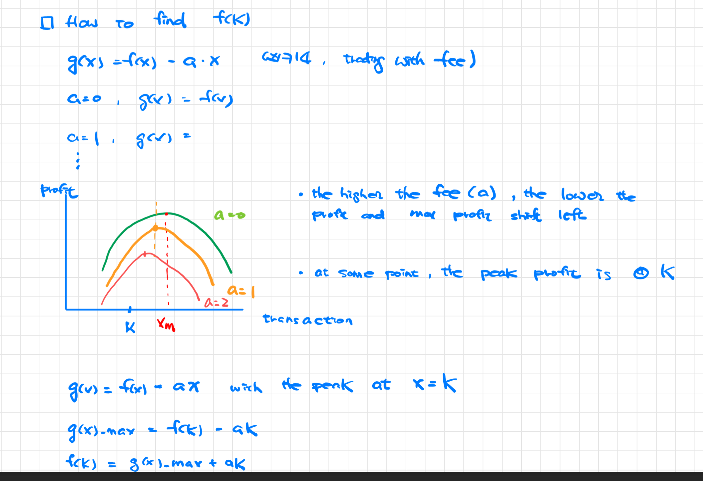

# Path in a Tree

2538
2421
2246
124
2049
687
1522\*
543
2467

# Binary Search

[0235] BST
[0236] BT
[1123] LCA on lowest leaves (same as 1676)
[1644] LCA on P, q that might not existing
[1650] LCA with pointer to parent
[1676] LCA on a set (same as 1123)

[1740]
[2096]
[2439]
[2519]

# Two Pointers

```
> template:
1. Givn an integer array.
2. Define qualification of a subarray
3. Calculate total number of qualifed subarrays in the original array

> key steps:
a. expand the window until it is disqualified (how to check the qualification?)
b. calculate/accumulate the required statistics
c. move (slide) the window

> Time: O(N)
```

[2762] M

# Max/Min of a sliding window

-> max value in sliding window

1. use deque <span style="color:red">(recording the index of the element, not the value)</span>
2. each time expand the window, pop the deque until the new window element is smaller than the last element in deque
3. each time shrinking the window,
4. the max is the first element in the deque <span style="color:red"> use the index to retrieve value from original array<span>

# Binary Index Tree (BIT)

```
* asking for range sum from an array
* "Binary index tree" can always solve "Segment Tree" problems
* The reason we are still larning "Segment Tree" is the required coding is less than "Binary index tree"
* Notice the BIT is 1 indexed
* The supported interface:
-> initialization
-> sumRange
-> updateDelta``
```



[0307] M

# Count Subarray by Element

# Sliding Window

[1151]
532.K-diff-Pairs-in-an-Array (H-)
611.Valid-Triangle-Number (M+)
930.Binary-Subarrays-With-Sum (M+)
1004.Max-Consecutive-Ones-III (M)
1052.Grumpy-Bookstore-Owner (M)
1358.Number-of-Substrings-Containing-All-Three-Characters (M)
1838.Frequency-of-the-Most-Frequent-Element (H-)
395.Longest-Substring-with-At-Least-K-Repeating-Characters (H)
1763.Longest-Nice-Substring (H)
2009.Minimum-Number-of-Operations-to-Make-Array-Continuous (M+)
2024.Maximize-the-Confusion-of-an-Exam (M)
424.Longest-Repeating-Character-Replacement (H-)
2106.Maximum-Fruits-Harvested-After-at-Most-K-Steps (H)
2401.Longest-Nice-Subarray (H-)
2411.Smallest-Subarrays-With-Maximum-Bitwise-OR (H-)
2516.Take-K-of-Each-Character-From-Left-and-Right (M+)
2564.Substring-XOR-Queries (H-)
2730.Find-the-Longest-Semi-Repetitive-Substring (M+)
2747.Count-Zero-Request-Servers (H-)
2831.Find-the-Longest-Equal-Subarray (M)
Sliding window : Distinct Characters
076.Minimum-Window-Substring (M+)
003.Longest-Substring-Without-Repeating-Character (E+)
159.Longest-Substring-with-At-Most-Two-Distinct-Characters(H-)
340.Longest-Substring-with-At-Most-K-Distinct-Characters (H)
992.Subarrays-with-K-Different-Integers (H-)
2461.Maximum-Sum-of-Distinct-Subarrays-With-Length-K (M)
2537.Count-the-Number-of-Good-Subarrays (M+)
Two pointers for two sequences
986.Interval-List-Intersections (M)
1229.Meeting-Scheduler (M+)
1537.Get-the-Maximum-Score (H-)
1577.Number-of-Ways-Where-Square-of-Number-Is-Equal-to-Product-of-Two-Numbers (H-)
1775.Equal-Sum-Arrays-With-Minimum-Number-of-Operations (M+)
1868.Product-of-Two-Run-Length-Encoded-Arrays (M+)
2098.Subsequence-of-Size-K-With-the-Largest-Even-Sum (M+)

```
Given an integer array
-> Define something for a subarray
-> Calc something for all subarrays

Ideas:
-> finding all subarrays and calc something -> O(N)
-> for each element as min/max -> find the max subarray that holds true
```

[0907] H :

> Monotonic Stack: sum of subarray min
> -> for each element as min, how many subarray this min can be?

[1856] M

[2104] M : sum of subarray range  
-> Define something as range: max-min of subarray  
-> Calc sum of all ranges

Observation 1:  
-> sum((max-min) of all subarrays)  
-> sum(max of all subarrays)-sum(min of all subarrays)

Observation 2:  
-> Min/Max of subarry  
-> Similar to Min/Max of Sliding Window  
-> Monotonic stack

Strategy:

> sum(max of all subarrays)

- precalc pre-larger and next-larger
- for each element as Max, we can find the valid window that the element is max
- (A): num of subarray of the "valid window" is left-length\*right-length
- (B): sum of subarray with that element as max: A \* element_value
- accumulate "B" for all elements -> we have sum(max of all subarrays)
- do the similar thing for min

# Monotonic Stack

=> PrevSmaller, NextSmaller, PrevGreater, NextGreater
[0496]
[0503]

# Count Subarray by Element

```
- Pattern: looking for some metrics of all sub-arrays
- All sub-arrays is O(N^2)
- We should pre-calc info for each element and bring down the time complexity
```

[1498]
[2302]
[2681] H : Power-of-Heroes

- sum of all (sub-sequence-max)^2\*subsequence-min
- Whenever grouping by subsequence, we can sort as the original order no longer matter
- Whenever we are looking for Nlog(N) time, we can sort
- All combination: O(N^2)  
  -> In order to meet nO(logn), we need to calc something for a set of group to reduce time-complexity

# DP

Time-Series
[0198] M : House Robber
[0123] : Best Time to Buy and Sell Stock III
[0213] : House Robber II
[0487]
[1186]
[1289]

# Design

[0146]
[0155]
[0355]
[0380]
[0381]
[0432]
[0460]
[0535]
[0588]
[0622]
[0631]
[0642]
[0895]
[1146]
[1172]
[1268]
[1352]
[1381]
[1622]
[1670]
[2166]
[2296]

# BFS

1591
1203
1857
2392
2204*
2115
802
310
2050
1136*
1462
210
207

# DFS

351*
2328
329
2305
1723
2313*
834
2322
2277\*

# Greedy

2055
524
1055*
792
2263*
2311
2332
2242
2350
2234
2333
2233
1405
984
621
358\*
1054
2335
1953
767

# Segment Tree

# Stack

503
255*
496
1063*
85
84
145
94
144
636
456
173
1096
1087*
1106
1381
439*
726
591
385
772\*
227
224
42
856
844
1019
173
341
232
768
1209
1190
225
155
32

# Heap

[2519] - <215>: binary search, sortedcontainers

# Graph

# Quick Select

[215]


# Top K elements
[215]
