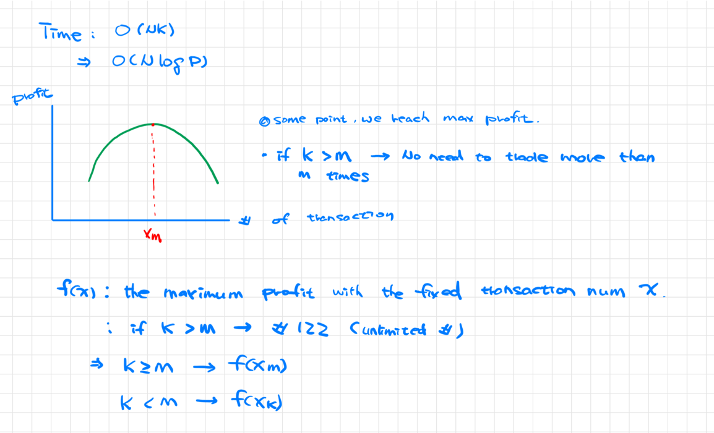
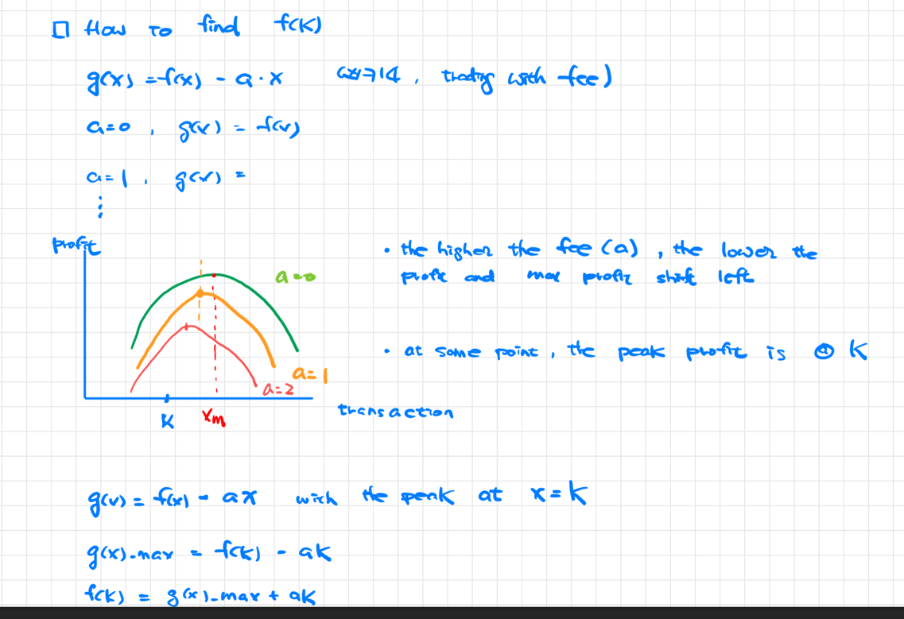

[Solution 1]:
# Ideas:
* Given a series of prices
* Given a set of allowed transactions (status)
* Optimize a formula (profit)

-> each transaction defines a status
-> current status comes from previous status -> Type I DP -> single var status
-> future status cannot affect historic status
=> DP

# Strategy:
- K transactions -> k status

for each date
  for each status
    consider what the current status could be and capture the global optimized value
  

[Solution 2]:

f(x): the maximum profit with the fixed transaction number x
Xm: the max profit with Xm transactions
f(k): when Xk < Xm
if K > M -> the questions become 122 (buy sell unlimited times)
How to find f(k)
g(x)=f(x)-a*x (transaction fee - cf 714)

a=0 g(x)=f(x)
a=1 g(x)=