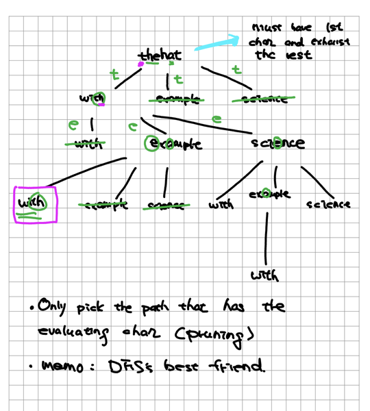

> Given target string, and a list of stickers of words.  min num of sticker required to spell-out the target string?

> Analysis
+ Inputs: stickers (50~)
+ N=len(target)
> Bruteforce - Search

> State Compression

> DFS idea
