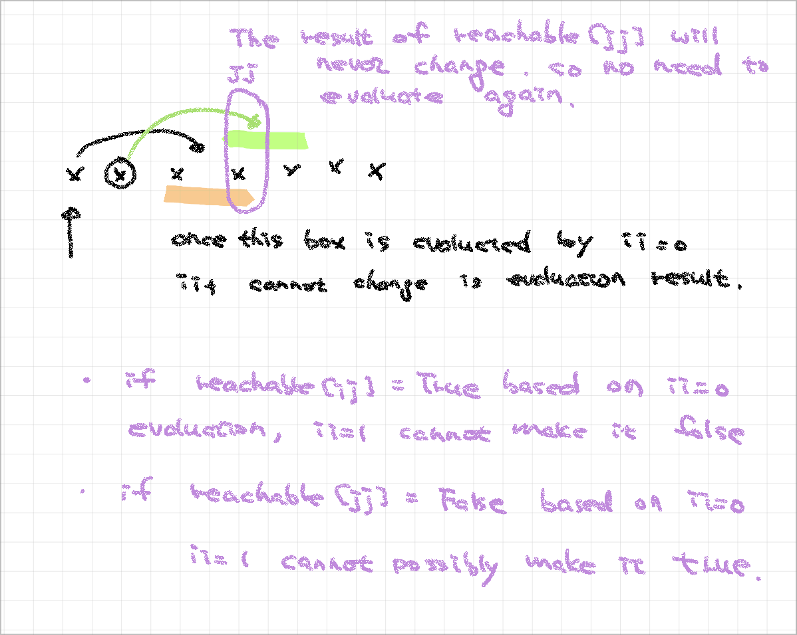

> Why we cannot use greedy algorithm for Jump Game VII.
> When we say greedy, we always jump to max reachable
> Considering Greedy.   Jump Game I (0055) VS Jump Game VII (1871)

* in Jump Game I: we have no limitation on which index is jumpable and no limitation on minJump.  That being the case, every index can be the starting point for the next jump.
* Considering Jump Game VII: we have minJump limitation.  so starting point become critical.  cuz we potentially could reach a JJ but because of minJump limitation, we could jump over the end.  Also, JJ could be an none "0" which cannot even be a index to jump from.

> Review Jump Game I (0055)
> Strategy of Jump Game VII

> for [bruteforce - optimized solution](./[1871]%20Jump%20Game%20VII%20-%20bruteforce%20optimized.py), why we can avoid double evaluation visited index?

> Interval
* presum