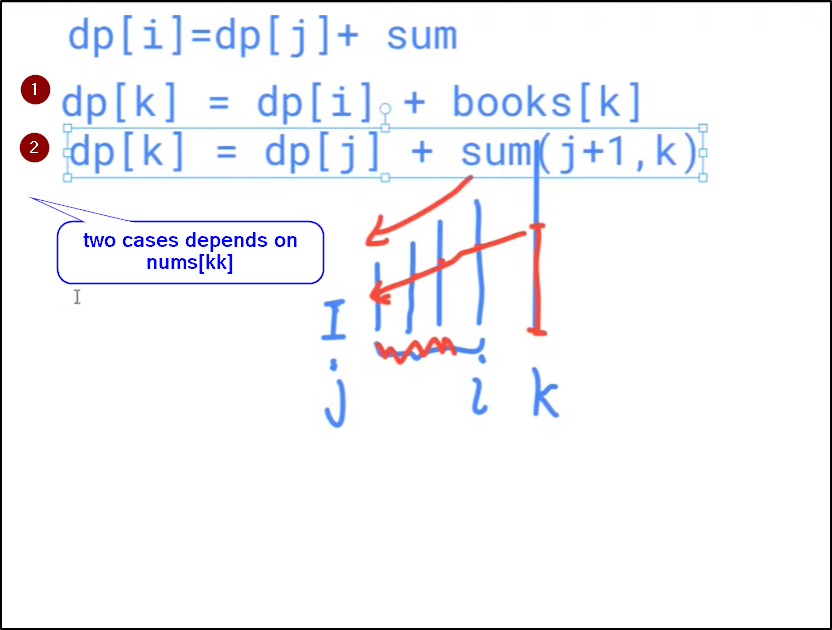

> inputs:
* books[ii]: num of books on iith shelf
* take books in range [ll, rr] with strick increasing order of num of books
=> max books you can get

> Analysis:
* N=10^5  -> nlogn

# Bruteforce:
* Greedy
* Binary Search
* DP: Single List relating to some prior jj (to determine range) -> type II

dp[ii]: the max num of books you can take from a subarray ending @ ii

x x x x [ x x x x ii] x
    [     3]7 8  9
          jj
L=ii-jj
sum = (books[ii]+books[ii-L+1])*L/2
dp[ii] = dp[jj]+sum

so far we are N^2, how to we further optimize given N=10^5?
=> using stack

