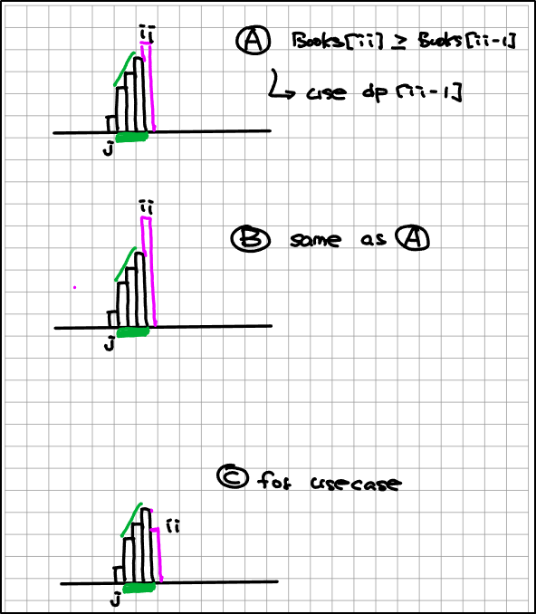

> inputs:
* books[ii]: num of books on iith shelf
* take books in range [ll, rr] with strick increasing order of num of books
=> max books you can get

> Analysis:
* N=10^5  -> nlogn

# Bruteforce:
* Greedy
* Binary Search
* DP: Single List relating to some prior jj (to determine range) -> type II

dp[ii]: the max num of books you can take from a subarray ending @ ii

x x x x [ x x x x ii] x
    [     3]7 8  9
          jj
L=ii-jj
sum = (books[ii]+books[ii-L+1])*L/2
dp[ii] = dp[jj]+sum

so far we are N^2, how to we further optimize given N=10^5?
=> using stack

Observing that we do not need dp[jj+1]...dp[ii-1] -> pop them from stack

stk=[j0, j1, j2] VS books[ii]
if books[kk] > books[ii]+1 -> use dp[ii]
if books[kk] <= books[ii]+1 -> pop from stk
every element on stack/off stck only once => ttl time complexity O(N)

=> DP Type II
- dp[ii]: max books you can take ending at ii with defined constrain
    dp[ii] = dp[ii-1] + books[ii] if books[ii] >= books[ii-1]
    dp[ii] = dp[jj] + arithmatic_sum[jj+1:ii+1] where books[jj] is NOT the expected "arithmetic progression"
            when books[ii] <= books[ii-1]+1, we will need to move backward until we locate the jj that is NOT the expected "arithmetic progression"       
    This would be N^2 solution (standard DP Type II Time complexity). But if we leverage a stack, this will reduce to O(N)  