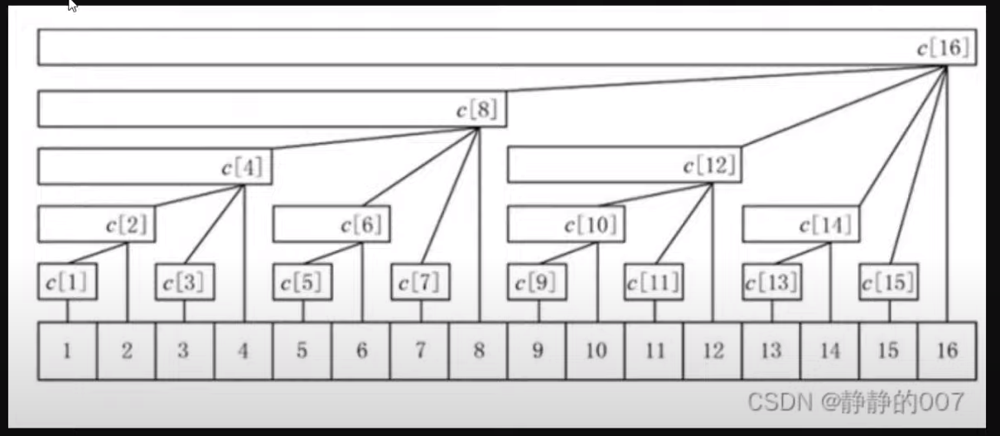

`Two Pointers`

```
> template:
1. Givn an integer array.
2. Define qualification of a subarray
3. Calculate total number of qualifed subarrays in the original array

> key steps:
a. expand the window until it is disqualified (how to check the qualification?)
b. calculate/accumulate the required statistics
c. move (slide) the window

> Time: O(N)
```

[2762] M \* -

`Max/Min of a sliding window`
-> max value in sliding window

1. use deque <span style="color:red">(recording the index of the element, not the value)</span>
2. each time expand the window, pop the deque until the new window element is smaller than the last element in deque
3. each time shrinking the window,
4. the max is the first element in the deque <span style="color:red"> use the index to retrieve value from original array<span>

`Binary Index Tree (BIT)`

```
* asking for range sum from an array
* "Binary index tree" can always solve "Segment Tree" problems
* The reason we are still larning "Segment Tree" is the required coding is less than "Binary index tree"
* Notice the BIT is 1 indexed
* The supported interface:
-> initialization
-> sumRange
-> updateDelta``
```



[0307] M \* -

`Count Subarray by Element`

```

```

[0907] H - Monotonic Stack: sum of subarray min
-> for each element as min, how many subarray this min can be?
[1856]
[2104] M \* : 'sum of subarray range'
-> 'Sum of subarray(max-min)
-> 'sum of subarray max'-'sum of subarray min'

`Monotonic Stack`
=> PrevSmaller, NextSmaller, PrevGreater, NextGreater
[0496]
[0503]

`DP`
Time-Series
[0198] M - House Robber
[0123] Best Time to Buy and Sell Stock III
[0213] House Robber II
[0487]
[1186]
[1289]
