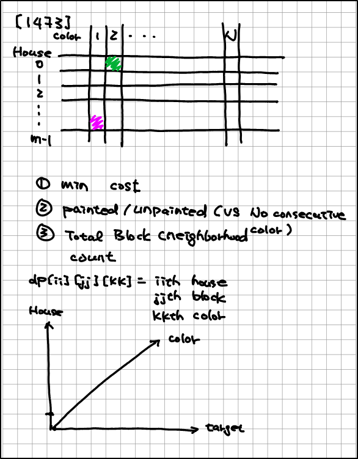

# <p style="text-align: center"> <span style="color:Orange"> Question List</span> </p>

[[0003] - <span style="color:yellow">M</span> - Longest Substring Without Repeating Characters](https://leetcode.com/problems/longest-substring-without-repeating-characters/description) - 
[[Python]]()
[[CPP]]() -
[[Video]]() -
[`Two Pointers`][`Sliding Window`]

[[0004] - <span style="color:red">H</span> - Median of Two Sorted Arrays](https://leetcode.com/problems/median-of-two-sorted-arrays/description) - 
[[Python]]()
[[CPP]](https://github.com/wisdompeak/LeetCode/tree/master/Priority_Queue/004.Median-of-Two-Sorted-Arrays) -
[[Video]](https://www.youtube.com/watch?v=5hNWtR2EcrU) -
[`Binary Search`]

- Binary search on two sorted array
- Find Kth element on two sorted array
- Find Kth element on N sorted array?

[[0005] - <span style="color:yellow">M</span> - Longest Palindromic Substring](https://leetcode.com/problems/longest-palindromic-substring/) - 
[[Python]](https://github.com/1688168/Leetcode/blob/main/LC/%5B0005%5D%20Longest%20Palindromic%20Substring.py)
[[CPP]](https://github.com/wisdompeak/LeetCode/tree/master/String/005.Longest-Palindromic-Substring) -
[[Video]](https://www.youtube.com/watch?v=Co5-YaJwq64) -
[`Palindrome`][`Manacher`]

- [1960]
- Manacher （马拉车） - O(N)
- KMP (string manipulation)

[[0013] - <span style="color:green">E</span> - Roman to Integer](https://leetcode.com/problems/roman-to-integer/description/) - 
[[Python]]()
[[CPP]]() -
[[Video]]() -
[`Recursion`]

[[0014] - <span style="color:green">E</span> - Longest Common Prefix](https://leetcode.com/problems/longest-common-prefix/description) - 
[[Python]]()
[[CPP]]() -
[[Video]]() -
[`Analysis`]

[[0015] - <span style="color:yellow">M</span> - 3Sum](https://leetcode.com/problems/3sum/) - 
[[Python]]()
[[CPP]]() -
[[Video]]() -
[`Two Pointers`][`classic`]

[[0019] - <span style="color:yellow">M</span> - Remove Nth Node From End of List](https://leetcode.com/problems/remove-nth-node-from-end-of-list/description/) - 
[[Python]]()
[[CPP]]() -
[[Video]]() -
[`LinkedList`][`Two Pointers`]


[[0020] - <span style="color:green">E</span> - Valid Parentheses](https://leetcode.com/problems/valid-parentheses/description/) - 
[[Python]]()
[[CPP]]() -
[[Video]]() -
[`Stack`]

[[0022] - <span style="color:yellow">M</span> - Generate Parentheses](https://leetcode.com/problems/generate-parentheses/description/) - 
[[Python]](https://github.com/1688168/Leetcode/blob/main/LC/%5B0022%5D%20Generate%20Parentheses.py)
[[CPP]]() -
[[Video]]() -
[`Recursive`]

[[0032] - <span style="color:red">H</span> - Longest Valid Parentheses](https://leetcode.com/problems/longest-valid-parentheses/description/) - 
[[Python]](https://github.com/1688168/Leetcode/blob/main/LC/%5B0032%5D%20Longest%20Valid%20Parentheses.py)
[[CPP]](https://github.com/wisdompeak/LeetCode/tree/master/Stack/032.Longest-Valid-Parentheses) -
[[Video]](https://www.youtube.com/watch?v=677VaZhd4dg) -
[`parentheses`]

- when you see pairing -> stack

[[0033] - <span style="color:yellow">M</span> - Search in Rotated Sorted Array](https://leetcode.com/problems/search-in-rotated-sorted-array/description) - 
[[Python]](https://github.com/1688168/Leetcode/blob/main/LC/%5B0033%5D%20Search%20in%20Rotated%20Sorted%20Array.py)
[[CPP]](https://github.com/wisdompeak/LeetCode/tree/master/Binary_Search/033.Search-in-Rotated-Sorted-Array) -
[[Video]](https://www.youtube.com/watch?v=e-UALGfQpOk) -
[`Binary Search`]

- [0081]

[0042] - <span style="color:red">H</span> - Trapping Rain Water](https://leetcode.com/problems/trapping-rain-water/description/) -
[[Python]]()
[[CPP]]() -
[[Video]](https://www.youtube.com/watch?v=LArMcFpCK-M&list=PPSV&t=1142) -
[`Monotonic Stack`][`Tow pointers`]

- Method I: two pass
- Method II: monotonic stack
- Method III: two pointers
- How to get left-max/right-max
- One pass monotonic stack
- [0084]
- [2334]

[[0045] - <span style="color:yellow">M</span> - Jump Game II](https://leetcode.com/problems/jump-game-ii/description/) - 
[[Python]]()
[[CPP]](https://github.com/wisdompeak/LeetCode/tree/master/Greedy/045.Jump-Game-II) -
[[Video]](https://www.youtube.com/watch?v=Ua_Vqtdd61E) -
[`Greedy`]

[[0046] - <span style="color:yellow">M</span> - Permutations](https://leetcode.com/problems/permutations/description/) - 
[[Python]]()
[[CPP]](https://github.com/wisdompeak/LeetCode/tree/master/Math/046.Permutations) -
[[Video]](https://www.youtube.com/watch?v=DAy4l04jFX0) -
[`Permutation`]

[[0047] - <span style="color:yellow">M</span> - Permutations II](https://leetcode.com/problems/permutations-ii/) - 
[[Python]]()
[[CPP]](https://github.com/wisdompeak/LeetCode/tree/master/Math/047.Permutations-II) -
[[Video]](https://www.youtube.com/watch?v=K6vqgAEyfng) -
[`Permutation`]

[[0049] - <span style="color:yellow">M</span> - Group Anagrams](https://leetcode.com/problems/group-anagrams/description/) - 
[[Python]]()
[[CPP]]() -
[[Video]]() -
[`Patterns`]

[[0053] - <span style="color:yellow">M</span> - Maximum Subarray](https://leetcode.com/problems/maximum-subarray/description/) - 
[[Python]](https://github.com/1688168/Leetcode/blob/main/LC/%5B0053%5D%20Maximum%20Subarray.py)
[[CPP]](https://github.com/1688168/Leetcode/blob/main/LC/%5B0053%5D%20Maximum%20Subarray.cpp) -
[[Video]](https://www.youtube.com/watch?v=laZ5jz8igU8) -
[`DP`][`Kadane`][`classic`]

- Kadane variation: 2272:

  - max subarray sum that requires two elements

  ```
  * regular kadane
  dp[i]=max(nums[i], dp[i-1]+nums[i])
  * Kadane Variation
  dp0[i]: the max subarray sum ending @ i and this subarray does NOT contain -1
  dp1[i]: the max subarray sum ending @ i and this subarray DOES contains -1

  for(int ii=0; ii<N; ++ii){
    if(nums[ii]==1){
      dp0[ii]=max(1, 1+dp0[ii-1]);
      dp1[ii]=dp1[ii-1]+1;
    }else{
      dp0[ii]=0
      dp1[ii]=-1+max(dp0[ii-1], dp1[ii-1])

    }
    ret=max(ret, dp1[ii ])
  }
  ```

[[0055] - <span style="color:yellow">M</span> - Jump Game](https://leetcode.com/problems/jump-game/description/) - 
[[Python]](https://github.com/1688168/Leetcode/blob/main/LC/%5B0055%5D%20Jump%20Game%20-%20DP.py)
[[CPP]](https://github.com/wisdompeak/LeetCode/tree/master/Greedy/055.Jump-Game) -
[[Video]](https://www.youtube.com/watch?v=J04GagAZ5io) -
[`DP`][`Jump Game`]

[[0056] - <span style="color:yellow">M</span> - Merge Intervals](https://leetcode.com/problems/merge-intervals/description/) - 
[[Python]](https://github.com/1688168/Leetcode/blob/main/LC/%5B0056%5D%20Merge%20Intervals.py)
[[CPP]](https://github.com/wisdompeak/LeetCode/tree/master/Others/056.Merge-Intervals) -
[[Video]]() -
[`Interval`]

[[0072] - <span style="color:yellow">M</span> - Edit Distance](https://leetcode.com/problems/edit-distance/description/) - 
[[Python]]()
[[CPP]](https://github.com/wisdompeak/LeetCode/tree/master/Dynamic_Programming/072.Edit-Distance) -
[[Video]](https://www.youtube.com/watch?v=MLBFJpDxjTA) -
[`DP`]

[[0075] - <span style="color:yellow">M</span> - Sort Colors](https://leetcode.com/problems/sort-colors/) - 
[[Python]]()
[[CPP]](https://github.com/wisdompeak/LeetCode/tree/master/Two_Pointers/075.Sort-Colors) -
[[Video]]() -
[`Two Pointers`]

[[0078] - <span style="color:yellow">M</span> - Subsets](https://leetcode.com/problems/subsets/submissions/604027794/) - 
[[Python]]()
[[CPP]]() -
[[Video]]() -
[`Subsets`]

[[0079] - <span style="color:yellow">M</span> - Word Search](https://leetcode.com/problems/word-search/) - 
[[Python]](https://github.com/1688168/Leetcode/blob/main/LC/%5B0079%5D%20Word%20Search.py)
[[CPP]]() -
[[Video]](https://www.youtube.com/watch?v=7nTdJGqZQXE) -
[`DFS`]

- backtrack -> no memo

  [[0081] - <span style="color:yellow">M</span> - desc]() - 
[[Python]]()
  [[CPP]](https://github.com/wisdompeak/LeetCode/tree/master/Binary_Search/081.Search-in-Rotated-Sorted-Array-II) -
  [[Video]](https://www.youtube.com/watch?v=e-UALGfQpOk) -
  [`Binary Search`]

- [0033]
- search rotated array

[[0084] - <span style="color:red">H</span> - Largest Rectangle in Histogram](https://leetcode.com/problems/largest-rectangle-in-histogram/description/) - 
[[Python]](https://github.com/1688168/Leetcode/blob/main/LC/%5B0084%5D%20Largest%20Rectangle%20in%20Histogram%20-%20one%20pass.py)
[[CPP]](https://github.com/wisdompeak/LeetCode/tree/master/Stack/084.Largest-Rectangle-in-Histogram) -
[[Video]](https://www.youtube.com/watch?v=mesaogfSjD4&t=109) -
[`Monotonic Stack`][`Count Subarray by Element`]

- Monotonic stack one pass
- The best way to find prev_smaller (NOT prev_smaller_equal)

[[0088] - <span style="color:green">E</span> - Merge Sorted Array](https://leetcode.com/problems/merge-sorted-array/description/) - 
[[Python]]()
[[CPP]]() -
[[Video]]() -
[`K-way merge`]

[[0090] - <span style="color:yellow">M</span> - Subsets II](https://leetcode.com/problems/subsets-ii/description/) - 
[[Python]]()
[[CPP]](https://github.com/wisdompeak/LeetCode/tree/master/DFS/090.Subsets-II) -
[[Video]](https://www.youtube.com/watch?v=Vn2v6ajA7U0) -
[`Subsets`]

[[0121] - <span style="color:green">E</span> - Best Time to Buy and Sell Stock](https://leetcode.com/problems/best-time-to-buy-and-sell-stock/description) - 
[[Python]]()
[[CPP]]() -
[[Video]]() -
[`Best Time Buy/Sell Stock`]

[[0123] - <span style="color:red">H</span> - Best Time to Buy and Sell Stock III
](https://leetcode.com/problems/best-time-to-buy-and-sell-stock-iii/) - 
[[Python]](https://github.com/1688168/Leetcode/blob/main/LC/%5B0123%5D%20Best%20Time%20to%20Buy%20and%20Sell%20Stock%20III.py)
[[CPP]](https://github.com/wisdompeak/LeetCode/tree/master/Dynamic_Programming/123.Best-Time-to-Buy-and-Sell-Stock-III) -
[[Video]](https://www.youtube.com/watch?v=gsL3T9bI1RQ) -
[`DP`]

[[0126] - <span style="color:red">H</span> - desc]() - 
[[Python]](https://github.com/1688168/Leetcode/blob/main/LC/%5B0126%5D%20Word%20Ladder%20II.py)
[[CPP]](https://github.com/wisdompeak/LeetCode/tree/master/BFS/126.Word-Ladder-II) -
[[Video]](https://www.youtube.com/watch?v=bGN7c34qzCg&t=23s) -
[`BFS`][`DFS`]

- beware of the local_visited concept, we cannot add visited until all nodes same level are processed complete

[[0127] - <span style="color:red">H</span> - Word Ladder](https://leetcode.com/problems/word-ladder/description/) - 
[[Python]](https://github.com/1688168/Leetcode/blob/main/LC/%5B0127%5D%20Word%20Ladder.py)
[[CPP]](https://github.com/wisdompeak/LeetCode/tree/master/BFS/127.Word-Ladder) -
[[Video]]() -
[`Patterns`]

[[0134] - <span style="color:yellow">M</span> - Gas Station](https://leetcode.com/problems/gas-station/description/) - 
[[Python]]()
[[CPP]]() -
[[Video]](https://www.youtube.com/watch?v=lJwbPZGo05A) -
[`Greedy`]

[[0135] - <span style="color:red">H</span> - Candy](https://leetcode.com/problems/candy/description/) - 
[[Python]]()
[[CPP]](https://github.com/wisdompeak/LeetCode/blob/master/Greedy/135.Candy/Readme.md) -
[[Video]](https://www.youtube.com/watch?v=QzPWc0ilEek&t=3s) -
[`Greedy`]

- [1840]
- [1846]

[[0139] - <span style="color:yellow">M</span> - Word Break](https://leetcode.com/problems/word-break/description/) -
[[Python]](https://github.com/1688168/Leetcode/blob/main/LC/%5B0139%5D%20Word%20Break_trie.py)
[[CPP]](https://github.com/wisdompeak/LeetCode/tree/master/Trie/139.Word-Break) -
[[Video]](https://www.youtube.com/watch?v=eYT-hKQ1au4&t=12s)

[[0140] - <span style="color:red">H</span> - Word Break II](https://leetcode.com/problems/word-break-ii/description/) - 
[[Python]]()
[[CPP]](https://githubhttps://github.com/1688168/Leetcode/blob/main/LC/%5B0140%5D%20Word%20Break%20II.py.com/wisdompeak/LeetCode/tree/master/Trie/140.Word-Break-II) -
[[Video]](https://www.youtube.com/watch?v=mXPDJg_vx4c&t=194s) -
[`Trie`]

[[0146] - <span style="color:yellow">M</span> - LRU Cache](https://leetcode.com/problems/lru-cache/) - 
[[Python]](https://github.com/1688168/Leetcode/blob/main/LC/%5B0146%5D%20LRU%20Cache.py)
[[CPP]](https://github.com/wisdompeak/LeetCode/tree/master/Design/146.LRU-Cache) -
[[Video]](https://www.youtube.com/watch?v=jX_k2FIhRI0&t=23s) -
[`Design`][`OrderedDict`]

```python
# OrderedDict
# front is the most recent used
# last is the least recent used
cache = OrderedDict()
* od.move_to_end()
* cache.popitem(last=False) # pop the last

```
- [0432]
- [0460]: LFU
- [0472] Concatenated Words

[[0151] - <span style="color:yellow">M</span> - Reverse Words in a String](https://leetcode.com/problems/reverse-words-in-a-string/description/) - 
[[Python]]()
[[CPP]]() -
[[Video]] -
[`Two Pointers`]


[[0153] - <span style="color:yellow">M</span> - Find Minimum in Rotated Sorted Array](https://leetcode.com/problems/find-minimum-in-rotated-sorted-array/description/) - 
[[Python]]()
[[CPP]]() -
[[Video]](https://www.youtube.com/watch?v=JxoTDj-7tmo&t=909s) -
[`Binary Search`]

[[0154] - <span style="color:red">H</span> - Find Minimum in Rotated Sorted Array II](https://leetcode.com/problems/find-minimum-in-rotated-sorted-array-ii/description/) - 
[[Python]]()
[[CPP]](https://github.com/wisdompeak/LeetCode/tree/master/Binary_Search/154.Find-Minimum-in-Rotated-Sorted-Array-II) -
[[Video]](https://www.youtube.com/watch?v=JxoTDj-7tmo&t=909s) -
[`Binary Search`]

[[0155] - <span style="color:green">E</span> - Min Stack](https://leetcode.com/problems/min-stack/) - 
[[Python]](https://github.com/1688168/Leetcode/blob/main/LC/%5B0155%5D%20Min-Stack.py)
[[CPP]](https://github.com/wisdompeak/LeetCode/tree/master/Stack/155.Min-Stack) -
[[Video]](https://www.youtube.com/watch?v=e3s8LZc6Cdo) -
[`Stack`]

[[0188] - <span style="color:red">H</span> - Best Time to Buy and Sell Stock IV](https://leetcode.com/problems/best-time-to-buy-and-sell-stock-iv/description/) - 
[[Python]]()
[[CPP]]() -
[[Video]](https://www.youtube.com/watch?v=lXRe__YD8JY&t=68s) -
[`DP`][`Binary Search`]

- [0122]: buy sell unlimited
- [0714]: buy sell with fee
- Alian Trick

[[0198] - <span style="color:green">E</span> - House Robber](https://leetcode.com/problems/house-robber/) - 
[[Python]](https://github.com/1688168/Leetcode/blob/main/LC/%5B0198%5D%20House%20Robber.py)
[[CPP]](https://github.com/wisdompeak/LeetCode/tree/master/Dynamic_Programming/198.House-Robber) -
[[Video]](https://www.youtube.com/watch?v=IcEX9Oi_tao) -
[`DP`][`Classic`][`DP - Type I Basic`]

[[0200] - <span style="color:yellow">M</span> - Number of Islands](https://leetcode.com/problems/number-of-islands/description/) - 
[[Python]](https://github.com/1688168/Leetcode/blob/main/LC/%5B0200%5D%20Number%20of%20Islands.py)
[[CPP]](https://github.com/wisdompeak/LeetCode/tree/master/DFS/200.Number-of-Islands) -
[[Video]](https://www.youtube.com/watch?v=prmHWUETpXw) -
[`DFS`][`classic`]

[[0202] - <span style="color:green">E</span> - Happy Number](https://leetcode.com/problems/happy-number/description/) - 
[[Python]]()
[[CPP]]() -
[[Video]]() -
[`Fast/Slow pointer`]


[[0206] - <span style="color:green">E</span> - Reverse Linked List](https://leetcode.com/problems/reverse-linked-list/) - 
[[Python]]()
[[CPP]]() -
[[Video]]() -
[`LinkedList`]

[[0207] - <span style="color:yellow">M</span> - Course Schedule](https://leetcode.com/problems/course-schedule/description/) - 
[[Python-BFS]](https://github.com/1688168/Leetcode/blob/main/LC/%5B0207%5D%20Course-Schedule-BFS.py)
[[Python-DFS]](https://github.com/1688168/Leetcode/blob/main/LC/%5B0207%5D%20Course-Schedule-DFS.py)
[[CPP]](https://github.com/wisdompeak/LeetCode/tree/master/BFS/207.Course-Schedule) -
[[Video]](https://www.youtube.com/watch?v=5fntVoXeW_A) -
[`Topology Sort`][`Classics`]

[[0210] - <span style="color:yellow"></span> - Course Schedule II](https://leetcode.com/problems/course-schedule-ii/) - 
[[Python]](course-schedule-ii/description)
[[CPP]](https://github.com/wisdompeak/LeetCode/blob/master/BFS/210.Course-Schedule-II/210.Course-Schedule-II.cpp) -
[[Video]](https://www.youtube.com/watch?v=DPO52m5XIOA&t=2s) -
[`Topology Sort`]

[[0212] - <span style="color:red">H</span> - Word Search II](https://leetcode.com/problems/word-search-ii/description/) - 
[[Python]](https://github.com/1688168/Leetcode/blob/main/LC/%5B0212%5D%20Word%20Search%20II.py)
[[CPP]](https://github.com/wisdompeak/LeetCode/tree/master/Trie/212.Word-Search-II) -
[[Video]](https://www.youtube.com/watch?v=nGGF_jQH0GQ) -
[`Trie`]

[[0213] - <span style="color:yellow">M</span> - House Robber II](https://leetcode.com/problems/house-robber-ii/) - 
[[Python]](https://github.com/1688168/Leetcode/blob/main/LC/%5B0213%5D%20House%20Robber%20II.py)
[[CPP]](https://github.com/wisdompeak/LeetCode/tree/master/Dynamic_Programming/213.House-Robber-II) -
[[Video]](https://www.youtube.com/watch?v=5NsRK9TDCRo) -
[`DP`]

[[0215] - <span style="color:yellow">M</span> - Kth Largest Element in an Array](https://leetcode.com/problems/kth-largest-element-in-an-array/description/) - 
[[Python]](https://github.com/1688168/Leetcode/blob/main/LC/%5B0215%5D%20Kth%20Largest%20Element%20in%20an%20Array%20-%20quickselect.py)
[[CPP]](https://github.com/wisdompeak/LeetCode/tree/master/Binary_Search/215.Kth-Largest-Element-in-an-Array) -
[[Video]](https://www.youtube.com/watch?v=dMq9_EkfSEc) -
[`Quick Select`]

[[0224] - <span style="color:red">H</span> - Basic Calculator](https://leetcode.com/problems/basic-calculator/) - 
[[Python]](https://github.com/1688168/Leetcode/blob/main/LC/%5B0224%5D%20Basic%20Calculator.md)
[[CPP]](https://github.com/wisdompeak/LeetCode/tree/master/Stack/224.Basic-Calculator) -
[[Video]](https://www.youtube.com/watch?v=t8wIrdWSDsE) -
[`Expression Parsing`][`Basic Calculator`]

[[0232] - <span style="color:green">E</span> - Implement Queue using Stacks](https://leetcode.com/problems/implement-queue-using-stacks/description/) - 
[[Python]]()
[[CPP]]() -
[[Video]]() -
[`Stack`]

[[0239] - <span style="color:red">H</span> - Sliding Window Maximum](https://leetcode.com/problems/sliding-window-maximum/description/) - 
[[Python]]()
[[CPP]](https://github.com/wisdompeak/LeetCode/tree/master/Deque/239.Sliding-Window-Maximum) -
[[Video]](https://www.youtube.com/watch?v=b1rqOQ5p6EA) -
[`deque`][`sorted list`][`bisect`][`SortedList`]

- [862]
- [1425]
- [1438]
- O(1) time output max value in sliding window
- find max in sliding window

[[0240] - <span style="color:yellow">M</span> - Search a 2D Matrix II](https://leetcode.com/problems/search-a-2d-matrix-ii/description/) - 
[[Python]](https://github.com/1688168/Leetcode/blob/main/LC/%5B0240%5D%20Searh%20a%202D%20Matrix%20II.py)
[[CPP]](https://github.com/wisdompeak/LeetCode/tree/master/Others/240.Search-a-2D-Matrix-II) -
[[Video]](https://www.youtube.com/watch?v=-IzCjqVsjZw) -
[`Matrix`]

[[0242] - <span style="color:green">E</span> - Valid Anagram](https://leetcode.com/problems/valid-anagram/description/) - 
[[Python]]()
[[CPP]]() -
[[Video]]() -
[`Anagram`]

[[0252] - <span style="color:green">E</span> - Meeting Rooms](https://leetcode.com/problems/meeting-rooms/description/) - 
[[Python]]()
[[CPP]](https://github.com/wisdompeak/LeetCode/tree/master/Others/252.Meeting-Roomsb) -
[[Video]]() -
[`Intervals`][`Sweep Line`]

[[0253] - <span style="color:yellow">M</span> - Meeting Rooms II](https://leetcode.com/problems/meeting-rooms-ii/description/) - 
[[Python]]()
[[CPP]]() -
[[Video]]() -
[`Intervals`]

[[0256] - <span style="color:yellow">M</span> - Paint House](https://leetcode.com/problems/paint-fence/description/) - 
[[Python]]()
[[CPP]](https://github.com/wisdompeak/LeetCode/tree/master/Dynamic_Programming/276.Paint-Fence) -
[[Video]]() -
[`DP`]

- N houses, cost of black is a, cost of white is b. cannot paint 3 houses with same color consequtively. what's the min cost to paint all houses?
- [0265]


[[0265] - <span style="color:red">H</span> - Paint House II](https://leetcode.com/problems/paint-house-ii/description/) - 
[[Python]]()
[[CPP]](https://github.com/wisdompeak/LeetCode/tree/master/Dynamic_Programming/265.Paint-House-II) -
[[Video]](https://www.bilibili.com/video/BV1sS4y1V7ZT/) -
[`DP`]

- same as [1289]

[[0266] - <span style="color:green">E</span> - Palindrome Permutation](https://leetcode.com/problems/palindrome-permutation/description/) - 
[[Python]]()
[[CPP]]() -
[[Video]]() -
[`Palindrome`]

[[0269] - <span style="color:red">H</span> - Alien Dictionary](https://leetcode.com/problems/alien-dictionary/description/) - 
[[Python]]()
[[CPP]](https://github.com/wisdompeak/LeetCode/tree/master/BFS/269.Alien-Dictionary) -
[[Video]](https://youtu.be/yfGJFDkyEmE) -
[`topology sort`][`classic`]

[[0273] - <span style="color:red">H</span> - Integer to English Words](https://leetcode.com/problems/integer-to-english-words/description/) - 
[[Python]](https://github.com/1688168/Leetcode/blob/main/LC/%5B0273%5D%20Integer%20to%20English%20Words.py)
[[CPP]]() -
[[Video]]() -
[`Recursive`]

[[0276] - <span style="color:yellow">M</span> - Paint Fence](https://leetcode.com/problems/paint-fence/description/) - 
[[Python]]()
[[CPP]](https://github.com/wisdompeak/LeetCode/tree/master/Dynamic_Programming/276.Paint-Fence) -
[[Video]](https://www.youtube.com/watch?v=XL1icaNQCa4&t=5s) -
[`DP`]

[[0287] - <span style="color:yellow">M</span> - Find the Duplicate Number](https://leetcode.com/problems/find-the-duplicate-number/description/) - 
[[Python]]()
[[CPP]](https://github.com/wisdompeak/LeetCode/tree/master/Binary_Search/287.Find-the-Duplicate-Number) -
[[Video]](https://www.youtube.com/watch?v=86co28GuZ5U&t=1700s) -
[`Indexing Sort`][`Binary Search`]

- Indexing Sort: O(N)
- Binary Search: Nlog(N)

[[0295] - <span style="color:red">H</span> - Find Median from Data Stream](https://leetcode.com/problems/find-median-from-data-stream/description/) - 
[[Python]]()
[[CPP]](https://github.com/wisdompeak/LeetCode/tree/master/Heap/295.Find-Median-from-Data-Stream) -
[[Video]](https://www.youtube.com/watch?v=dy8AdRodlkQ) -
[`heap`][`SortedList`][`Medium`]

[[0297] - <span style="color:red">H</span> - Serialize and Deserialize Binary Tree](https://leetcode.com/problems/serialize-and-deserialize-binary-tree/description/) - 
[[Python]](https://github.com/1688168/Leetcode/blob/main/LC/%5B0297%5D%20Serialize%20and%20Deserialize%20Binary%20Tree%20-%20BFS.py)
[[CPP]](https://github.com/wisdompeak/LeetCode/tree/master/Tree/297.Serialize-and-Deserialize-Binary-Tree) -
[[Video]](https://www.youtube.com/watch?v=6tUBiOYbYgY&t=8s) -
[`Tree Serialization`][`classic`]

[[0300] - <span style="color:yellow">M</span> - Longest Increasing Subsequence](https://leetcode.com/problems/longest-increasing-subsequence/description/) - 
[[Python]](https://github.com/1688168/Leetcode/blob/main/LC/%5B0300%5D%20Longest%20increasing%20Subsequence%20-%20Binary%20Search.py)
[[CPP]](https://github.com/wisdompeak/LeetCode/tree/master/Greedy/300.Longest-Increasing-Subsequence) -
[[Video]](https://www.youtube.com/watch?v=Q6KyDl_xiIg) -
[`sub-sequence`][`DP`][`classic`][`DP Type II`]

- DP Bottom-up: O(N^2)
- Binary Search: Nlog(N)
- DP Top-Down(Cache): MLE
- DP Top-Down:
  - Using 2D-array is more efficient than using dictionary


[[0301] - <span style="color:red">H</span> - Remove Invalid Parentheses](https://leetcode.com/problems/remove-invalid-parentheses/description/) - 
[[Python]]()
[[CPP]](https://github.com/wisdompeak/LeetCode/tree/master/DFS/301.Remove-Invalid-Parentheses) -
[[Video]](https://www.youtube.com/watch?v=NWAseBzZj-c) -
[`Parentheses`][`Search in an array`]

- review search in an array
- DFS: pruning/eliminate duplication/memo

[[0307] - <span style="color:yellow">M</span> - Range Sum Query - Mutable](https://leetcode.com/problems/range-sum-query-mutable/description/) - 
[[Python]]()
[[CPP]](https://github.com/wisdompeak/LeetCode/tree/master/Segment_Tree/307.Range-Sum-Query-Mutable) -
[[video-Binary Index Tree]](https://www.youtube.com/watch?v=hdkB8q77XSE) -
[[Video-segment tree]](https://www.youtube.com/watch?v=hdkB8q77XSE) -
[`Segment Tree`][`classic`][`Binary Index Tree`]

- Segment Tree Intro/Classic
- Binary Index Tree [[template]](https://github.com/wisdompeak/LeetCode/blob/master/Template/Binary_Index_Tree/BIT.cpp)
- [[python solution]](https://yunrui-li.medium.com/leetcode-binary-index-tree-59fc04d8d20d)
- [303]
- [315]

[[0309] - <span style="color:yellow">M</span> - Best Time to Buy and Sell Stock with Cooldown](https://leetcode.com/problems/best-time-to-buy-and-sell-stock-with-cooldown/description/) - 
[[Python]]()
[[CPP]](https://github.com/wisdompeak/LeetCode/tree/master/Dynamic_Programming/309.Best-Time-to-Buy-and-Sell-Stock-with-Cooldown) -
[[Video]](https://www.youtube.com/watch?v=jNy8yM0NBdw) -
[`DP`]

[[0312] - <span style="color:red">H</span> - Burst Balloons](https://leetcode.com/problems/burst-balloons/description/) - 
[[Python]]()
[[CPP]]() -
[[Video]](https://www.youtube.com/watch?v=BBdHB2jjNUA&t=29s) -
[`DP`]

[[0315] - <span style="color:red">H</span> - Count of Smaller Numbers After Self](https://leetcode.com/problems/count-of-smaller-numbers-after-self/description/) - 
[[Python]]()
[[CPP]](https://github.com/wisdompeak/LeetCode/tree/master/Divide_Conquer/315.Count-of-Smaller-Numbers-After-Self) -
[[Video]](https://www.youtube.com/watch?v=z-uLlQMvOVM&t=129s) -
[`Divide and Conquer`]

[[0324] - <span style="color:yellow">M</span> Wiggle Sort II](https://leetcode.com/problems/wiggle-sort-ii/description/) - 
[[Python]]()
[[CPP]](https://github.com/wisdompeak/LeetCode/tree/master/Others/324.Wiggle-Sort-II) -
[[Video]](https://www.youtube.com/watch?v=48AAAx30zNY) -
[`Quick Select`]

[[0327] - <span style="color:red">H</span> - Count of Range Sum](https://leetcode.com/problems/count-of-range-sum/description/) - 
[[Python]]()
[[CPP]](https://github.com/wisdompeak/LeetCode/tree/master/Divide_Conquer/327.Count-of-Range-Sum) -
[[Video]](https://www.youtube.com/watch?v=m9P1drvDjzY) -
[`Divide and Conquer`]

[[0332] - <span style="color:red">H</span> - Reconstruct Itinerary](https://leetcode.com/problems/reconstruct-itinerary/description/) - 
[[Python]]()
[[CPP]](https://github.com/wisdompeak/LeetCode/tree/master/DFS/332.Reconstruct-Itinerary) -
[[Video]](https://www.youtube.com/watch?v=5yM3H0UgXTo) -
[`DFS`][`Eulerian Path`]

- Given an Eulerian Path, construct the Eulerian path
- graph with list (adjacency list) to maintain lexical order
- how to reconstruct graph path with lexical order

[[0341] - <span style="color:yellow">M</span> - Flatten Nested List Iterator](https://leetcode.com/problems/flatten-nested-list-iterator/description/) - 
[[Python]]()
[[CPP]](https://github.com/wisdompeak/LeetCode/tree/master/Stack/341.Flatten-Nested-List-Iterator) -
[[Video]](https://www.youtube.com/watch?v=R2dohSHOWXQ) -
[`Stack`][`Generator`]

[[0347] - <span style="color:yellow">M</span> - Top K Frequent Elements](https://leetcode.com/problems/top-k-frequent-elements/description/) - 
[[Python]](https://github.com/1688168/Leetcode/blob/main/LC/%5B0347%5D%20Top%20K%20Frequent%20Elements%20-%20quick%20select.py)
[[CPP]](https://github.com/wisdompeak/LeetCode/tree/master/Others/347.Top-K-Frequent-Elements) -
[[video1]](https://www.bilibili.com/video/BV12K411w7J8/?vd_source=c1f78303f3760ca1601e9654954004a6)
[[Video2]](https://www.youtube.com/watch?v=6hjV-IdrOd0) -
[`Quick Select`]

[[0348] - <span style="color:yellow">M</span> - Design Tic-Tac-Toe](https://leetcode.com/problems/design-tic-tac-toe/description/) - 
[[Python]]()
[[CPP]](https://github.com/wisdompeak/LeetCode/tree/master/Others/348.Design-Tic-Tac-Toe) -
[[Video]]() -
[`Design`]

[[0355] - <span style="color:yellow">M</span> - Design Twitter](https://leetcode.com/problems/design-twitter/) - 
[[Python]]()
[[CPP]](https://github.com/wisdompeak/LeetCode/tree/master/Design/355.Design-Twitter) -
[[Video]](https://www.youtube.com/watch?v=q6RILQAaFvc) -
[`Design`]

- pull or push design
- push: new follower won't get history post
- pull, follower only keep top 10 records

[[0358] - <span style="color:red">H</span> - Rearrange String k Distance Apart](https://leetcode.com/problems/rearrange-string-k-distance-apart/description/) - 
[[Python]]()
[[CPP]](https://github.com/wisdompeak/LeetCode/tree/master/Priority_Queue/358.Rearrange-String-k-Distance-Apart) -
[[Video]](https://www.bilibili.com/video/BV1wo4y1D7zv/?vd_source=c1f78303f3760ca1601e9654954004a6) -
[`Arrangement with Stride`][`Greedy`][`classic`]

[[0368] - <span style="color:yellow">M</span> - Largest Divisible Subset](https://leetcode.com/problems/largest-divisible-subset/description/) - 
[[Python]]()
[[CPP]](https://github.com/wisdompeak/LeetCode/tree/master/Dynamic_Programming/368.Largest-Divisible-Subset) -
[[Video]](https://www.youtube.com/watch?v=hrwP6I5v1XY) -
[`DP`]

* all pairs are divisible in a set -> we do not need to try all pairs, just sort and confirm nums[ii]%nums[jj]==0 for ii=jj+1
* when dealing with subset on a single array and N^2 is the decided algorithm -> sorting the original array a lot of time has benefits
* DP output the path -> record the prev for tracing back

- avoid recording the whole path. try recording prev and trace back

```cpp
//c++ max of vector elements
int mx_sz = *(std::max_element(dp.begin(), dp.end()));
```

[[0370] - <span style="color:yellow">M</span> - Range Addition](https://leetcode.com/problems/range-addition/description/) - 
[[Python]]()
[[CPP]](https://github.com/wisdompeak/LeetCode/tree/master/Segment_Tree/370.Range-Addition) -
[[Video]](https://www.youtube.com/watch?v=b9gMT2sqeJI) -
[`Intervals`][`Segment Tree`][`Range Addition`]

- [1109]

[[0373] - <span style="color:yellow">M</span> - Find K Pairs with Smallest Sums](https://leetcode.com/problems/find-k-pairs-with-smallest-sums/) - 
[[Python]]()
[[CPP]](https://github.com/wisdompeak/LeetCode/tree/master/Binary_Search/373.Find-K-Pairs-with-Smallest-Sums) -
[[Video]](https://www.youtube.com/watch?v=TsOzIxkzh1E&t=998s) -
[`Binary Search`][`TopK`]

- the initial value of ans is special

[[0375] - <span style="color:yellow">M</span> - Guess Number Higher or Lower II](https://leetcode.com/problems/guess-number-higher-or-lower-ii/description/) - 
[[Python]]()
[[CPP]]() -
[[Video]](https://www.youtube.com/watch?v=VfJPDNG0nYM) -
[`DP`][`Interval DP`]

[[0376] - <span style="color:yellow">M</span> - Wiggle Subsequence](https://leetcode.com/problems/wiggle-subsequence/description/) - 
[[Python]]()
[[CPP]](https://github.com/wisdompeak/LeetCode/tree/master/Dynamic_Programming/376.Wiggle-Subsequence) -
[[Video-sol]](https://youtu.be/j7U3olaBxMg?t=27) -
[`DP`][`Greedy`]

> Greedy Solution: find number of turning points


[[0378] - <span style="color:yellow">M</span> - Kth Smallest Element in a Sorted Matrix](https://leetcode.com/problems/kth-smallest-element-in-a-sorted-matrix/description/) - 
[[Python]](https://github.com/1688168/Leetcode/blob/main/LC/%5B0378%5D%20Kth%20Smallest%20Element%20in%20a%20Sorted%20Matrix.py)
[[CPP]](https://github.com/wisdompeak/LeetCode/tree/master/Binary_Search/378.Kth-Smallest-Element-in-a-Sorted-Matrix) -
[[Video]](https://www.youtube.com/watch?v=JJUv4DDLSB4&t=4s) -
[`Find K0th Element`][`Top K`][`Binary Search`]

- [0240] Search a 2D Matrix II (how to traverse matrix with sorted row/col)
- [0373] (similar question)
- [2040]

[[0380] - <span style="color:yellow">M</span> - Insert Delete GetRandom O(1)](https://leetcode.com/problems/insert-delete-getrandom-o1) - 
[[Python]](https://github.com/1688168/Leetcode/blob/main/LC/%5B0380%5D%20Insert%20Delete%20GetRandom%20O(1).py)
[[CPP]](https://github.com/wisdompeak/LeetCode/blob/master/Design/380.Insert-Delete-GetRandom-O-1/380.Insert%20Delete%20GetRandom%20O(1).cpp) -
[[Video]](https://www.youtube.com/watch?v=jE6VIeQxzLU) -
[`Design`]

[[0381] - <span style="color:red">H</span> - Insert Delete GetRandom O(1) - Duplicates allowed](https://leetcode.com/problems/insert-delete-getrandom-o1-duplicates-allowed/) - 
[[Python]](https://github.com/1688168/Leetcode/blob/main/LC/%5B0381%5D%20Insert-Delete-GetRandom-O(1)-Duplicates-allowed.py)
[[CPP]](https://github.com/wisdompeak/LeetCode/blob/master/Design/381.Insert-Delete-GetRandom-O1-Duplicates-allowed/381.Insert-Delete-GetRandom-O1-Duplicates-allowed.cpp) -
[[Video]](https://www.youtube.com/watch?v=IqUJz-enhGA) -
[`Design`]

[[0387] - <span style="color:green">E</span> - First Unique Character in a String](https://leetcode.com/problems/first-unique-character-in-a-string/description/) - 
[[Python]]()
[[CPP]]() -
[[Video]]() -
[`MISC`]

[[0394] - <span style="color:yellow">M</span> - Decode String](https://leetcode.com/problems/decode-string/description) - 
[[Python]]()
[[CPP]]() -
[[Video]](https://www.youtube.com/watch?v=-M-EoXtufLY) -
[`stack`]

- review basic calculators

[[0402] - <span style="color:yellow">M</span> - Remove K Digits](https://leetcode.com/problems/remove-k-digits/description/) - 
[[Python]]()
[[CPP]](https://github.com/wisdompeak/LeetCode/tree/master/Stack/402.Remove-K-Digits) -
[[Video]](https://www.youtube.com/watch?v=qaYimfZwbk8) -
[`Stack`][`monotonic stack`][`classic`][`form smallest sequence`]

- How to make a list of number monotonically increasing
  
[[408] - <span style="color:green">E</span> - Valid Word Abbreviation](https://leetcode.com/problems/valid-word-abbreviation/description/) - 
[[Python]]()
[[CPP]]() -
[[Video]]() -
[`Two Pointers`]


[[0432] - <span style="color:red">H</span> - All O`one Data Structure](https://leetcode.com/problems/all-oone-data-structure/description/) - 
[[Python]]()
[[CPP]](https://github.com/wisdompeak/LeetCode/tree/master/Design/432.All-O-one-Data-Structure) -
[[Video]](https://www.youtube.com/watch?v=1TK2a26zU6I) -
[`Design`][`LinkedList`]

- O(1) key/value update
- O(1) retrieving any key of min/max frequency
- how to maintain frequency order to look back key
- maintain min/max and order of frequency -> list
- maintain medium -> two heap 


[[0435] - <span style="color:yellow">M</span> - Non-overlapping Intervals](https://leetcode.com/problems/non-overlapping-intervals/description/) - 
[[Python]](https://github.com/1688168/Leetcode/blob/main/LC/%5B0435%5D%20Non-Overlapping%20Intervals.py)
[[CPP]](https://github.com/wisdompeak/LeetCode/tree/master/Greedy/435.Non-overlapping-Intervals) -
[[Video]](https://www.youtube.com/watch?v=x6wREca18nw) -
[`interval`][`classic`]

- Sort by Starting Point or Ending Point?

[[0460] - <span style="color:red">H</span> - LFU Cache](https://leetcode.com/problems/lfu-cache/description/) - 
[[Python]](https://github.com/1688168/Leetcode/blob/main/LC/%5B0460%5D%20LFU%20Cache.py)
[[CPP]](https://github.com/wisdompeak/LeetCode/tree/master/Design/460.LFU-Cache) -
[[Video]](https://www.youtube.com/watch?v=EpLALCho36w) -
[`Design`][`OrderedDict`]

- File system is Trie
- removing kv from OrderedDict:
  ```
  # removing a key from OrderedDict
  * val=self.f2kv[freq].pop(key)
  # removing the front/back element from OrderedDict
  * min_k, min_v=self.f2kv[self.min_freq].popitem(last=False)
  ```

[[0472] - <span style="color:red">H</span> - Concatenated Words](https://leetcode.com/problems/concatenated-words/description/) - 
[[Python]]()
[[CPP]](https://github.com/wisdompeak/LeetCode/tree/master/Trie/472.Concatenated-Words) -
[[Video]](https://www.youtube.com/watch?v=dsnTJscs4BA) -
[`Trie`]

- word break (139, 140)
- memo (lru_cache) is the best friend of DFS

[[0474] - <span style="color:yellow">M</span> - Ones and Zeroes](https://leetcode.com/problems/ones-and-zeroes/description/) - 
[[Python]]()
[[CPP]]() -
[[Video]](https://www.youtube.com/watch?v=R-U_pY0OBKI) -
[`Patterns`]


[[0487] - <span style="color:yellow">M</span> - Max Consecutive Ones II](https://leetcode.com/problems/max-consecutive-ones-ii/description/) - 
[[Python]]()
[[CPP]](https://github.com/wisdompeak/LeetCode/tree/master/Dynamic_Programming/487.Max-Consecutive-Ones-II) -
[[Video]](https://www.youtube.com/watch?v=D2ZSacsq_fw) -
[`DP`]

[[0493] - <span style="color:red">H</span> - Reverse Pairs](https://leetcode.com/problems/reverse-pairs/description/) - 
[[Python]]()
[[CPP]](https://github.com/wisdompeak/LeetCode/tree/master/Divide_Conquer/493.Reverse-Pairs) -
[[Video]](https://www.youtube.com/watch?v=97_B1X_jPXQ) -
[`Divide Conquer`]

- divide and conquer - sol1
- Python: Sorted List - sol2

[[0494] - <span style="color:yellow">M</span> - Target Sum](https://leetcode.com/problems/target-sum/description/) - 
[[Python]]()
[[CPP]](https://github.com/wisdompeak/LeetCode/tree/master/Dynamic_Programming/494.Target-Sum) -
[[Video]](https://www.youtube.com/watch?v=MTMxgyJt3VM) -
[`DP`]

- [2518]

[[0495] - <span style="color:green">E</span> - Teemo Attacking](https://leetcode.com/problems/teemo-attacking/description/) - 
[[Python]]()
[[CPP]]() -
[[Video]]() -
[`Intervals`]

[[0500] - <span style="color:red">H</span> - desc]() - 
[[Python]]()
[[CPP]]() -
[[Video]]() -
[`Patterns`]


[[0535] - <span style="color:yellow">M</span> - Encode and Decode TinyURL](https://leetcode.com/problems/encode-and-decode-tinyurl/description/) - 
[[Python]]()
[[CPP]](https://github.com/wisdompeak/LeetCode/tree/master/Design/535.Encode-and-Decode-TinyURL) -
[[Video]](https://www.youtube.com/watch?v=fxLsDMiUVKg) -
[`Design`]


[[0543] - <span style="color:green">E</span> - Diameter of Binary Tree](https://leetcode.com/problems/diameter-of-binary-tree/description/) - 
[[Python]](https://github.com/1688168/Leetcode/blob/main/LC/%5B0543%5D%20Diameter%20of%20Binary%20Tree.py)
[[CPP]]() -
[[Video]]() -
[`Tree`]

[[0547] - <span style="color:yellow">M</span> - Number of Provinces](https://leetcode.com/problems/number-of-provinces/description/) - 
[[Python]]()
[[CPP]](https://github.com/wisdompeak/LeetCode/tree/master/Union_Find/547.Friend-Circles) -
[[Video]](https://www.youtube.com/watch?v=ZK8Jz4WuJsQ) -
[`Union Find`][`classic`]

[[0560] - <span style="color:yellow">M</span> - Subarray Sum Equals K](https://leetcode.com/problems/subarray-sum-equals-k/description) - 
[[Python]]()
[[CPP]]() -
[[Video]]() -
[`Patterns`]

[[0581] - <span style="color:yellow">M</span> - Shortest Unsorted Continuous Subarray](https://leetcode.com/problems/shortest-unsorted-continuous-subarray/description) - 
[[Python]](https://github.com/1688168/Leetcode/blob/main/LC/%5B0581%5D%20Shortest%20Unsorted%20Continuous%20Subarray.py)
[[CPP]](https://github.com/wisdompeak/LeetCode/blob/master/Greedy/581.shortest-unsorted-continuous-subarray/581.shortest-unsorted-continuous-subarray.cpp) -
[[Video]]() -
[`Greedy`][`Monotonic stack`]

[[0583] - <span style="color:yellow">M</span> - Delete Operation for Two Strings](https://leetcode.com/problems/delete-operation-for-two-strings/description/) - 
[[Python]]()
[[CPP]](https://github.com/wisdompeak/LeetCode/tree/master/Dynamic_Programming/583.Delete-Operation-for-Two-Strings) -
[[Video]](https://www.youtube.com/watch?v=O1K_T4ZqstM&t=8s) -
[`DP`]

[[0588] - <span style="color:red">H</span> - Design In-Memory File System
](https://leetcode.com/problems/design-in-memory-file-system/description/) - 
[[Python]](https://github.com/1688168/Leetcode/blob/main/LC/%5B0588%5D%20Design%20In-Memory%20File%20System.py)
[[CPP]](https://github.com/wisdompeak/LeetCode/tree/master/Trie/588.Design-In-Memory-File-System) -
[[Video]](https://www.bilibili.com/video/BV1GR4y1u74J/?vd_source=c1f78303f3760ca1601e9654954004a6) -
[`Design`][`Trie`]

[[0620] - <span style="color:green">E</span> - Not Boring Movies](https://leetcode.com/problems/not-boring-movies/description/) - 
[[Python]]()
[[CPP]]() -
[`SQL`]

- sql mod

[[0596] - <span style="color:green">E</span> - Big Countries](https://leetcode.com/problems/big-countries/description/) - 
[[Python]]()
[[CPP]]() -
[[Video]]() -
[`SQL`][`Pandas]

[[0621] - <span style="color:yellow">M</span> - Task Scheduler](https://leetcode.com/problems/task-scheduler/description/) - 
[[Python]]()
[[CPP]](https://github.com/wisdompeak/LeetCode/tree/master/Priority_Queue/621.Task-Scheduler) -
[[Video]](https://www.youtube.com/watch?v=3DZE7cfgYyg) -
[`Intervals`][`Sweep Line`][`Arrangement with Stride`][`Greedy`]

- [0358]
- Simulation (using heap)
- O(N) solution for arrangement with stride:

[[0632] - <span style="color:red">H</span> - Smallest Range Covering Elements from K Lists](https://leetcode.com/problems/smallest-range-covering-elements-from-k-lists/description/) - 
[[Python]]()
[[CPP]](https://github.com/wisdompeak/LeetCode/tree/master/Heap/632.Smallest-Range-Covering-Elements-from-K-Lists) -
[[Video]](https://www.youtube.com/watch?v=ejVD92bJe34) -
[`heap`]

- max with custom key for sorting
- how to manage max value in a min_heap

[[0636] - <span style="color:yellow">M</span> - Exclusive Time of Functions](https://leetcode.com/problems/exclusive-time-of-functions/description/) - 
[[Python]]()
[[CPP]](https://github.com/wisdompeak/LeetCode/tree/master/Stack/636.Exclusive-Time-of-Functions) -
[[Video]](https://www.youtube.com/watch?v=Ka4cDRolnBE) -
[`Stack`]

[[0642] - <span style="color:red">H</span> - Design Search Autocomplete System](https://leetcode.com/problems/design-search-autocomplete-system/description/) - 
[[Python]](https://github.com/1688168/Leetcode/blob/main/LC/%5B0642%5D%20Design%20Search%20Autocomplete%20System%20-%20ylee.py)
[[CPP]](https://github.com/wisdompeak/LeetCode/tree/master/Design/642.Design-Search-Autocomplete-System) -
[[Video]](https://www.bilibili.com/video/BV1VT41137Cc/) -
[`Trie`][`Design`]

- [1268]

```yaml
- Given a dictionary for lookup -> Trie
- Sort by (freq, lexical order), but Trie at best is lexical order only -> need sorting @ end for final output
- preserve current iter and current user input and use DFS to find all in scope words
```

[[0652] - <span style="color:yellow">M</span> - Find Duplicate Subtrees](https://leetcode.com/problems/find-duplicate-subtrees/description/) - 
[[Python]](https://github.com/1688168/Leetcode/blob/main/LC/%5B0668%5D%20Kth%20Smallest%20Number%20in%20Multiplication%20Table.py)
[[CPP]](https://github.com/wisdompeak/LeetCode/tree/master/Tree/652.Find-Duplicate-Subtrees) -
[[Video]](https://www.youtube.com/watch?v=YupKiFqtnsA) -
[`Tree`][`Tree Serialize`]

- [1948]

[[0668] - <span style="color:red">H</span> - Kth Smallest Number in Multiplication Table](https://leetcode.com/problems/kth-smallest-number-in-multiplication-table/description/) - 
[[Python]]()
[[CPP]](https://github.com/wisdompeak/LeetCode/tree/master/Binary_Search/668.Kth-Smallest-Number-in-Multiplication-Table) -
[[Video]](https://www.youtube.com/watch?v=oL7JXNpiKJs) -
[`Binary Search`][`Sorted Matrix`]

- Sorted matrix

[[0673] - <span style="color:yellow">M</span> - Number of Longest Increasing Subsequence](https://leetcode.com/problems/number-of-longest-increasing-subsequence/description/) - 
[[Python]]()
[[CPP]](https://github.com/wisdompeak/LeetCode/tree/master/Dynamic_Programming/673.Number-of-Longest-Increasing-Subsequence) -
[[Video]](https://www.youtube.com/watch?v=ESUKmxtA5sY&t=2s) -
[`DP`]

- [0300]: longest increasing subsequence

```python
# defaultdict of value=1 int
idx2cnt = collections.defaultdict(lambda: 1)

```

[[0691] - <span style="color:red">H</span> - Stickers to Spell Word](https://leetcode.com/problems/stickers-to-spell-word/description/) - 
[[Python]]()
[[CPP]](https://github.com/wisdompeak/LeetCode/tree/master/Dynamic_Programming/691.Stickers-to-Spell-Word) -
[[Video]](https://youtu.be/QusReweeTqI) -
[`State Compression`]
- cf: word break

[[0692] - <span style="color:yellow">M</span> - Top K Frequent Words](https://leetcode.com/problems/top-k-frequent-words/description) - 
[[Python]]()
[[CPP]]() -
[[Video]]() -
[`Quick Select`][`heap`][`bucket sort`]

[[0703] - <span style="color:green">E</span> - Kth Largest Element in a Stream](https://leetcode.com/problems/kth-largest-element-in-a-stream/description/) - 
[[Python]]()
[[CPP]]() -
[[Video]]() -
[`TopK`]

[[0719] - <span style="color:red">H</span> - Find K-th Smallest Pair Distance](https://leetcode.com/problems/find-k-th-smallest-pair-distance/description/) - 
[[Python]]()
[[CPP]](https://github.com/wisdompeak/LeetCode/tree/master/Binary_Search/719.Find-K-th-Smallest-Pair-Distance) -
[[Video]](https://www.youtube.com/watch?v=rKVivKCchFc&t=334) -
[`TopK`][`Binary Search`][`Two Dimentional TopK`]

- How to apply binary search with paired distance
- If we decided NlogN as time complexity -> sort if you can.
- Can you do this in Quick-select?

[[0759] - <span style="color:red">H</span> - Employee Free Time](https://leetcode.com/problems/employee-free-time/description) - 
[[Python]]()
[[CPP]](https://github.com/wisdompeak/LeetCode/tree/master/Others/759.Employee-Free-Time) -
[[Video]](https://www.bilibili.com/video/BV1QU4y1L7CF/?vd_source=c1f78303f3760ca1601e9654954004a6) -
[`Sweep Line`]

[[0763] - <span style="color:yellow">M</span> - Partition Labels](https://leetcode.com/problems/partition-labels/description/) - 
[[Python]]()
[[CPP]]() -
[[Video]]() -
[`Intervals`]

[[0767] - <span style="color:yellow">M</span> - Reorganize String](https://leetcode.com/problems/reorganize-string/description/) - 
[[Python]]()
[[CPP]](https://github.com/wisdompeak/LeetCode/tree/master/Greedy/767.Reorganize-String) -
[[Video]](https://www.youtube.com/watch?v=7wLb-9J1otU&t=17s) -
[`TopK`][`Greedy`][`arrangement with stride`]

- [0358]: k=2
- [1054]
- [1953]

[[0772] - <span style="color:red">H</span> - Basic Calculator III](https://leetcode.com/problems/basic-calculator-iii/description/) - 
[[Python]]()
[[CPP]](https://github.com/wisdompeak/LeetCode/tree/master/Stack/772.Basic-Calculator-III) -
[[Video]](https://www.youtube.com/watch?v=Tm_hHBhQgII) -
[`String Manipulation`][`calculator`]

[[0815] - <span style="color:red">H</span> - Bus Routes](https://leetcode.com/problems/bus-routes/description/) - 
[[Python]]()
[[CPP]](https://github.com/wisdompeak/LeetCode/tree/master/BFS/815.Bus-Routes) -
[[Video]](https://www.youtube.com/watch?v=gSr3ii4ipsk) -
[`BFS`]

- BFS variation

[[0828] - <span style="color:red">H</span> - Count Unique Characters of All Substrings of a Given String](https://leetcode.com/problems/count-unique-characters-of-all-substrings-of-a-given-string/description/) - 
[[Python]](https://github.com/1688168/Leetcode/blob/main/LC/%5B0828%5D%20Count%20Unique%20Characters%20of%20All%20Substrings%20of%20a%20Given%20String%20-%20v2.py)
[[CPP]](https://github.com/wisdompeak/LeetCode/tree/master/Greedy/828.Count-Unique-Characters-of-All-Substrings-of-a-Given-String) -
[[Video]](https://www.youtube.com/watch?v=NngeskF1wsw) -
[`Count Subarray by Element`]

- [2262] VS [828]: unique char VS distinct char in subarray
- unique: ignore chars with duplicates
- distinct: duplicate chars count as 1

[[0843] - <span style="color:red">H</span> - Guess the Word](https://leetcode.com/problems/guess-the-word/description/) - 
[[Python]]()
[[CPP]](https://github.com/wisdompeak/LeetCode/tree/master/Others/843.Guess-the-Word) -
[[Video]](https://www.youtube.com/watch?v=8_86eMEoKeE) -
[[Video 2]](https://www.youtube.com/watch?v=M-2RYdWa9gM "Edword")
[`Design`][`Others`]

[[0871] - <span style="color:red">H</span> - Minimum Number of Refueling Stops](https://leetcode.com/problems/minimum-number-of-refueling-stops/description/) - 
[[Python]]()
[[CPP]](https://github.com/wisdompeak/LeetCode/tree/master/Greedy/871.Minimum-Number-of-Refueling-Stops) -
[[Video]](https://www.youtube.com/watch?v=ntMfHvpFryI) -
[`Greedy`]

[[0875] - <span style="color:yellow">M</span> - Koko Eating Bananas](https://leetcode.com/problems/koko-eating-bananas/description) - 
[[Python]](https://github.com/1688168/Leetcode/blob/main/LC/%5B0875%5D%20Koko%20Eating%20Bananas.py)
[[CPP]]() -
[[Video]](https://www.youtube.com/watch?v=yfWVWbi9pts) -
[`Binary Search`]

[[0879] - <span style="color:red">H</span> - Profitable Schemes](https://leetcode.com/problems/profitable-schemes/description/) - 
[[Python]]()
[[CPP]](https://github.com/wisdompeak/LeetCode/tree/master/Dynamic_Programming/879.Profitable-Schemes) -
[[Video]](https://www.youtube.com/watch?v=SGod9bCXYfw) -
[`DP`][`Knapsack`][`classics - Reverse DP thinking`]

```yaml
> Two ways of DP transition function
1. dp[ii] = ... f(dp[j]) where j < i
2. dp[ii] => dp[jj]+= ... where jj > ii
```
- [2518]

[[0881] - <span style="color:yellow">M</span> - Boats to Save People](https://leetcode.com/problems/boats-to-save-people/description/) - 
[[Python]]()
[[CPP]](https://github.com/wisdompeak/LeetCode/tree/master/Greedy/881.Boats-to-Save-People) -
[[Video]](https://www.youtube.com/watch?v=yX5zRzTbeJc) -
[`Greedy`]

[[0895] - <span style="color:red">H</span> - Maximum Frequency Stack](https://leetcode.com/problems/maximum-frequency-stack/description/) - 
[[Python]]()
[[CPP]](https://github.com/wisdompeak/LeetCode/tree/master/Design/895.Maximum-Frequency-Stack) -
[[Video]](https://www.youtube.com/watch?v=2cf4BI8HF74) -
[`Design`][`Stack`]

[[0921] - <span style="color:yellow">M</span> - Minimum Add to Make Parentheses Valid](https://leetcode.com/problems/minimum-add-to-make-parentheses-valid/description/) - 
[[Python]]()
[[CPP]](https://github.com/wisdompeak/LeetCode/tree/master/Greedy/921.Minimum-Add-to-Make-Parentheses-Valid) -
[[Video]](https://www.youtube.com/watch?v=Sv5Xb-kfDok) -
[`Parentheses`][`Greedy`]

[[0931] - <span style="color:yellow">M</span> - Minimum Falling Path Sum](https://leetcode.com/problems/minimum-falling-path-sum/description/) - 
[[Python]]()
[[CPP]](https://github.com/wisdompeak/LeetCode/tree/master/Dynamic_Programming/931.Minimum-Falling-Path-Sum) -
[[Video]](https://www.youtube.com/watch?v=XmPNR9QinmE) -
[`DP`]

[[0937] - <span style="color:yellow">M</span> - Reorder Data in Log Files](https://leetcode.com/problems/reorder-data-in-log-files/description) - 
[[Python]](https://github.com/1688168/Leetcode/blob/main/LC/%5B0937%5D%20Reorder%20Data%20in%20Log%20Files.py)
[[CPP]]() -
[[Video]]() -
[`Sorting`]

[[0946] - <span style="color:yellow">M</span> - Validate Stack Sequences](https://leetcode.com/problems/validate-stack-sequences/description/) - 
[[Python]]()
[[CPP]](https://github.com/wisdompeak/LeetCode/tree/master/Stack/946.Validate-Stack-Sequences) -
[[video]](https://www.youtube.com/watch?v=zeCItXGLw0w) -
[`Stack`]

- How to validate a stack sequence? -> use stack to validate stack sequence

```yaml
1. keep adding element to stk from pushed until stk[-1]==popped[jj]
2. keep popping until stk is empty or jj >= len(popped)
3. return not stk
```

[[0956] - <span style="color:red">H</span> - Tallest Billboard](https://leetcode.com/problems/tallest-billboard/description/) - 
[[Python]]()
[[CPP]]() -
[[Video]](https://www.youtube.com/watch?v=mE27VU08BGU&t=14s) -
[`DP`]

* [0805]

[[0968] - <span style="color:red">H</span> - Binary Tree Cameras](https://leetcode.com/problems/binary-tree-cameras/description/) - 
[[Python]]()
[[CPP]]() -
[[Video]]() -
[`Tree`][`DP`][`Greedy`]

- Tree with DP

[[0973] - <span style="color:yellow">M</span> - K Closest Points to Origin](https://leetcode.com/problems/k-closest-points-to-origin/description/) - 
[[Python]](https://github.com/1688168/Leetcode/blob/main/LC/%5B0973%5D%20K%20Closest%20Points%20to%20Origin%20-%20quick%20select.py)
[[CPP]](https://github.com/wisdompeak/LeetCode/tree/master/Others/973.K-Closest-Points-to-Origin) -
[[Video]](https://www.youtube.com/watch?v=xi4QVECpmxQ) -
[`Quick`]

[[0986] - <span style="color:yellow">M</span> - Interval List Intersections](https://leetcode.com/problems/interval-list-intersections/description/) - 
[[Python]]()
[[CPP]]() -
[[Video]](https://www.youtube.com/watch?v=yqSvsHA08w4) -
[`Intervals`]

[[0990] - <span style="color:yellow">M</span> - Satisfiability of Equality Equations](https://leetcode.com/problems/satisfiability-of-equality-equations/) - [[Python - UnionFind]](https://github.com/1688168/Leetcode/blob/main/LC/%5B0990%5D%20Satisfiability%20of%20Equality%20Equations%20-%20Union%20Find.py)
[[Python - DFS]](https://github.com/1688168/Leetcode/blob/main/LC/%5B0990%5D%20Satisfiability%20of%20Equality%20Equations%20-%20DFS.py)
[[CPP]]() -
[[Video-UnionFind 1]](https://www.youtube.com/watch?v=VDZkBXPR4fE)
[[Video-UnionFind 2]](https://www.youtube.com/watch?v=x_c-OSW-8Iw&t=0s)
[[Video-BFS]](https://www.youtube.com/watch?v=K2oLZTE53kk&t=0s) -
[`BFS`] [`Union Find`]

- [2307]

[[0995] - <span style="color:red">H</span> - Minimum Number of K Consecutive Bit Flips](https://leetcode.com/problems/minimum-number-of-k-consecutive-bit-flips/description/) - 
[[Python]]()
[[CPP]](https://github.com/wisdompeak/LeetCode/tree/master/Others/995.Minimum-Number-of-K-Consecutive-Bit-Flips) -
[[Video]](https://www.youtube.com/watch?v=c5o-x_kD8d8) -
[`sweep line`][`range addition`]

[[1000] - <span style="color:red">H</span> - desc](https://leetcode.com/problems/longest-common-subsequence/description) - 
[[Python]]()
[[CPP]]() -
[[Video]]() -
[`Patterns`]

[[1020] - <span style="color:yellow">M</span> - Number of Enclaves](https://leetcode.com/problems/number-of-enclaves/description) - 
[[Python]]()
[[CPP]]() -
[[Video]]() -
[`DFS`]

- [1254]

[[1024] - <span style="color:yellow">M</span> - Video Stitching](https://leetcode.com/problems/video-stitching/description/) - 
[[Python]]()
[[CPP]](https://github.com/wisdompeak/LeetCode/tree/master/Greedy/1024.Video-Stitching) -
[[Video]](https://www.youtube.com/watch?v=ofzrZEQvHXY) -
[`Greedy`]

[[1028] - <span style="color:red">H</span> - Recover a Tree From Preorder Traversal](https://leetcode.com/problems/recover-a-tree-from-preorder-traversal/description/) - 
[[Python]]()
[[CPP]](https://github.com/wisdompeak/LeetCode/tree/master/Tree/1028.Recover-a-Tree-From-Preorder-Traversal) -
[[Video]](https://www.youtube.com/watch?v=IKyFotRqM2w) -
[`Tree`]

[[1029] - <span style="color:yellow">M</span> - Two City Scheduling](https://leetcode.com/problems/two-city-scheduling/description/) - 
[[Python]]()
[[CPP]]() -
[[Video]](https://www.youtube.com/watch?v=d-B_gk_gJtQ) -
[`Greedy`]

[[1035] - <span style="color:yellow">M</span> - Uncrossed Lines](https://leetcode.com/problems/uncrossed-lines/description/) - 
[[Python]]()
[[CPP]](https://github.com/wisdompeak/LeetCode/tree/master/Dynamic_Programming/1035.Uncrossed-Lines) -
[[Video]](https://www.youtube.com/watch?v=x_djkQhnuTk) -
[`DP`]

[[1043] - <span style="color:yellow">M</span> - Partition Array for Maximum Sum](https://leetcode.com/problems/partition-array-for-maximum-sum/description/) - 
[[Python]]()
[[CPP]]() -
[[Video]](https://www.youtube.com/watch?v=Zd00uagpi4U) -
[`DP`]

- same as [1105]
- vs [1959]

[[1044] - <span style="color:red">H</span> - Longest Duplicate Substring](https://leetcode.com/problems/longest-duplicate-substring/description/) - 
[[Python]]()
[[CPP]](https://github.com/wisdompeak/LeetCode/tree/master/String/1044.Longest-Duplicate-Substring) -
[[Video]](https://www.youtube.com/watch?v=N7EE0VamNqc) -
[`rolling hash`][`Binary Search`][`二哈哈希`]

- DP: dp[i][j]= (s[i]==s[j])? dp[i-1][j-1]+1
  ans = max(dp[i][j], i=0,...n, j=0,...,n)

[[1049] - <span style="color:yellow">M</span> - Last Stone Weight II](https://leetcode.com/problems/last-stone-weight-ii/description/) - 
[[Python]]()
[[CPP]]() -
[[Video]](https://www.youtube.com/watch?v=oVEXfrdO_WE) -
[`DP`][`0/1 Hacksack`]

```md
1. basic knapsack solution
  * we actually know the sum of A (B is just total-sum(A))
  * in fact, we do NOT need to know the actual sum(A), we just need to know if sum(A) is feasible

Todo:
* video solution
* use c++ set solution for Java/python
* Java try use stream
* review 215's solutions
* redo [0494] target sum
* list of 0/1 knapsack

2. exhaustive method
```

- [0494] - target sum
- [1755]
- [2035]
- 穷举法 （exhaustive method)
- list of 0/1 kanpsack

[[1054] - <span style="color:yellow">M</span> - Distant Barcodes](https://leetcode.com/problems/distant-barcodes/description/) - 
[[Python]]()
[[CPP]](https://github.com/wisdompeak/LeetCode/tree/master/Greedy/1054.Distant-Barcodes) -
[[Video]](https://www.youtube.com/watch?v=_rehsshRKYg) -
[`Greedy`][`arrangement with Stride`]

- [0358]
- [0767]

[[1092] - <span style="color:red">H</span> - Shortest Common Supersequence](https://leetcode.com/problems/shortest-common-supersequence/description/) - 
[[Python]]()
[[CPP]](https://github.com/wisdompeak/LeetCode/tree/master/Dynamic_Programming/1092.Shortest-Common-Supersequence) -
[[Video]](https://www.youtube.com/watch?v=Uk9JRbylA0c) -
[`DP`][`classic`]

- DP returning path

[[1105] - <span style="color:yellow">M</span> - Filling Bookcase Shelves](https://leetcode.com/problems/filling-bookcase-shelves/description/) - 
[[Python]]()
[[CPP]](https://github.com/wisdompeak/LeetCode/tree/master/Dynamic_Programming/1105.Filling-Bookcase-Shelves) -
[[Video]](https://www.youtube.com/watch?v=H5p6bUdk-e4) -
[`DP`]

[[1109] - <span style="color:yellow">M</span> - Corporate Flight Bookings](https://leetcode.com/problems/corporate-flight-bookings/description/) - 
[[Python]]()
[[CPP]](https://github.com/wisdompeak/LeetCode/tree/master/Others/1109.Corporate-Flight-Bookings) -
[[Video]](https://www.youtube.com/watch?v=bfzEK_mkmBk) -
[`Sweep Line`][`Range Addition`][`Diff Array`]

[[1143] - <span style="color:yellow">M</span> - Longest Common Subsequence]() - 
[[Python]](https://github.com/1688168/Leetcode/blob/main/LC/%5B1143%5D%20Longest%20Common%20Subsequence.py)
[[CPP]](https://github.com/wisdompeak/LeetCode/tree/master/Dynamic_Programming/1143.Longest-Common-Subsequence) -
[[Video]](https://www.youtube.com/watch?v=CEnb7Ho7TYc) -
[`DP`][`classic`]

- [Failed]: Amazon

[[1151] - <span style="color:yellow">M</span> - Minimum Swaps to Group All 1s Together](https://leetcode.com/problems/minimum-swaps-to-group-all-1s-together/description) - 
[[Python]](https://github.com/1688168/Leetcode/blob/main/LC/%5B1151%5D%20Minimum%20Swaps%20to%20Group%20Al%201s%20Together.py)
[[CPP]]() -
[[Video]]() -
[`Sliding Window`]

- [idiom]: presum template

[[1172] - <span style="color:red">H</span> - Dinner Plate Stacks](https://leetcode.com/problems/dinner-plate-stacks/description/) - 
[[Python]]()
[[CPP]](https://github.com/wisdompeak/LeetCode/tree/master/Design/1172.Dinner-Plate-Stacks) -
[[Video]](https://www.youtube.com/watch?v=5OzyykyZfIw&t=1203s) -
[`Design`]

- [0460] LFU

[[1186] - <span style="color:yellow">M</span> - Maximum Subarray Sum with One Deletion](https://leetcode.com/problems/maximum-subarray-sum-with-one-deletion/description/) - 
[[Python]]()
[[CPP]](https://github.com/wisdompeak/LeetCode/tree/master/Dynamic_Programming/1186.Maximum-Subarray-Sum-with-One-Deletion) -
[[Video]](https://www.youtube.com/watch?v=NUjks0ZZBrg) -
[`DP`]

[[1203] - <span style="color:red">H</span> - Sort Items by Groups Respecting Dependencies](https://leetcode.com/problems/sort-items-by-groups-respecting-dependencies/) - 
[[Python]](https://github.com/1688168/Leetcode/blob/main/LC/%5B1591%5D%20Strange-Printer-II.py)
[[CPP]](https://github.com/wisdompeak/LeetCode/blob/master/BFS/1203.Sort-Items-by-Groups-Respecting-Dependencies/1203.Sort-Items-by-Groups-Respecting-Dependencies.cpp) -
[[Video]](https://www.youtube.com/watch?v=NP9ia_QU0l8&list=PPSV&t=1041) -
[`Topology Sort`]

[[1207] - <span style="color:green">E</span> - Unique Number of Occurrences](https://leetcode.com/problems/unique-number-of-occurrences/) - 
[[Python]]()
[[CPP]]() -
[[Video]]() -
[`Hash`]

[[1235] - <span style="color:red">H</span> - Maximum Profit in Job Scheduling](https://leetcode.com/problems/maximum-profit-in-job-scheduling/description/) - 
[[Python]]()
[[CPP]](https://github.com/wisdompeak/LeetCode/tree/master/Greedy/1235.Maximum-Profit-in-Job-Scheduling) -
[[Video]](https://www.youtube.com/watch?v=0C7re8lam7M) -
[`DP`][`Greedy`]

- [435] From all the overlapping intervals, we pick the 1st interval (sorted by end-time)(least overlapping with future intervals). Greedy strategy
- [1235] for Max Profit, we cannot simply pick the first one (least overlapping) as we are trying to max(profit)

[[1245] - <span style="color:yellow">M</span> - Tree Diameter](https://leetcode.com/problems/tree-diameter/description/) - 
[[Python]]()
[[CPP]](https://github.com/wisdompeak/LeetCode/tree/master/BFS/1245.Tree-Diameter) -
[[Video]]() -
[`Patterns`]

[[1249] - <span style="color:yellow">M</span> - Minimum Remove to Make Valid Parentheses](https://leetcode.com/problems/minimum-remove-to-make-valid-parentheses/description/) - 
[[Python]]()
[[CPP]](https://github.com/wisdompeak/LeetCode/tree/master/Greedy/1249.Minimum-Remove-to-Make-Valid-Parentheses) -
[[Video]](https://www.youtube.com/watch?v=U1nwBAIQ-oc) -
[`stack`][`Greedy`][`parentheses`]

[[1251] - <span style="color:green">E</span> - Average Selling Price](https://leetcode.com/problems/average-selling-price/description/) - 
[[Python]]()
[[CPP]]() -
[[Video]]() -
[`SQL`]

- join with between, SQL between
- SQL round
- Pandas sort_values
- pandas merge_asof

[[1254] - <span style="color:yellow">M</span> - Number of Closed Islands](https://leetcode.com/problems/number-of-closed-islands/description/) - 
[[Python]]()
[[CPP]]() -
[[Video]](https://www.youtube.com/watch?v=X8k48xek8g8) -
[`DFS`]

> Islands

- [0200]
- [1020]

[[1268] - <span style="color:yellow">M</span> - Search Suggestions System](https://leetcode.com/problems/search-suggestions-system/description/) - 
[[Python]]()
[[CPP]](https://github.com/wisdompeak/LeetCode/tree/master/Trie/1268.Search-Suggestions-System) -
[[Video]](https://www.youtube.com/watch?v=GTPgTxTuung&t=1201s) -
[`Trie`][`binary search`]

- [642]

```yaml
- search suggestion sort lexically
```

[[1278] - <span style="color:red">H</span> - Palindrome Partitioning III](https://leetcode.com/problems/palindrome-partitioning-iii/description/) - 
[[Python]]()
[[CPP]](https://github.com/wisdompeak/LeetCode/tree/master/Dynamic_Programming/1278.Palindrome-Partitioning-III) -
[[Video]](https://www.youtube.com/watch?v=0lhalhxmhmw) -
[`DP`]

[[1289] - <span style="color:red">H</span> - Minimum Falling Path Sum II](https://leetcode.com/problems/minimum-falling-path-sum-ii/description/) - 
[[Python]]()
[[CPP]](https://github.com/wisdompeak/LeetCode/tree/master/Dynamic_Programming/1289.Minimum-Falling-Path-Sum-II) -
[[Video]](https://www.youtube.com/watch?v=euD2WFdUp6U) -
[`DP`]

- [0256]: paint house I
- [0265]: Paint house II -- review this python code see how to share a loop
- [0931]

[[1293] - <span style="color:red">H</span> - Shortest Path in a Grid with Obstacles Elimination](https://leetcode.com/problems/shortest-path-in-a-grid-with-obstacles-elimination/) - 
[[Python]]()
[[CPP]](https://github.com/wisdompeak/LeetCode/tree/master/BFS/1293.Shortest-Path-in-a-Grid-with-Obstacles-Elimination) -
[[Video]](https://youtu.be/2pLhH2eLaP8) -
[`BFS`][`BFS Variation`]

[[1326] - <span style="color:red">H</span> - Minimum Number of Taps to Open to Water a Garden](https://leetcode.com/problems/minimum-number-of-taps-to-open-to-water-a-garden/description/) - 
[[Python]]()
[[CPP]](Greedy/1326.Minimum-Number-of-Taps-to-Open-to-Water-a-Garden) -
[[Video]](https://www.youtube.com/watch?v=WHafLkS9_-E) -
[`Greedy`][`Interval`]

- this is intervals
- [1024]

[[1352] - <span style="color:yellow">M</span> - Product of the Last K Numbers](https://leetcode.com/problems/product-of-the-last-k-numbers/description/) - 
[[Python]]()
[[CPP]](https://github.com/wisdompeak/LeetCode/tree/master/Design/1352.Product-of-the-Last-K-Numbers) -
[[Video]](https://www.youtube.com/watch?v=CnEPfZYoCd8) -
[`Design`]

- preprod, how to handle zero

[[1360] - <span style="color:green">E</span> - Number of Days Between Two Dates](https://leetcode.com/problems/number-of-days-between-two-dates/description/) - 
[[Python]](https://github.com/1688168/Leetcode/blob/main/LC/%5B1360%5D%20Number%20of%20Days%20Between%20Two%20Date.py)
[[CPP]]() -
[[Video]]() -
[`MISC`]

[[1372] - <span style="color:yellow">M</span> - Longest ZigZag Path in a Binary Tree](https://leetcode.com/problems/longest-zigzag-path-in-a-binary-tree/description) - 
[[Python]]()
[[CPP]]() -
[[Video]](https://www.youtube.com/watch?v=XOa2yhUd3fw) -
[`binary Tree`][`recursion`]

[[1381] - <span style="color:yellow">M</span> - Design a Stack With Increment Operation](https://leetcode.com/problems/design-a-stack-with-increment-operation/description/) - 
[[Python]]()
[[CPP]](https://github.com/wisdompeak/LeetCode/tree/master/Design/1381.Design-a-Stack-With-Increment-Operation) -
[[Video]](https://www.youtube.com/watch?v=aWDCbFIsUfw) -
[`Design`]

- application of "range addition"
- [1109]

[[1473] - <span style="color:yellow">M</span> - Paint House III](https://leetcode.com/problems/paint-house-iii/description/) - 
[[Python]]()
[[CPP]]() -
[[Video]](https://www.youtube.com/watch?v=OLUb7awzwig) -
[`DP`]


- [1959]

[[1431] - <span style="color:green">E</span> - Kids With the Greatest Number of Candies](https://leetcode.com/problems/kids-with-the-greatest-number-of-candies/description) - 
[[Python]](https://github.com/1688168/Leetcode/blob/main/LC/%5B1431%5D%20Kids%20With%20The%20Greatest%20Number%20Of%20Candies.py)
[[CPP]]() -
[[Video]]() -
[`Patterns`]

[[1492] - <span style="color:yellow">M</span> - The Kth Factor of n](https://leetcode.com/problems/the-kth-factor-of-n/description/) - 
[[Python]]()
[[CPP]]() -
[[Video]]() -
[`Patterns`]

[[1498] - <span style="color:yellow">M</span> - Number of Subsequences That Satisfy the Given Sum Condition](https://leetcode.com/problems/number-of-subsequences-that-satisfy-the-given-sum-condition/description/) - 
[[Python]](https://github.com/1688168/Leetcode/blob/main/LC/%5B1498%5D%20Number%20of%20Subsequences%20That%20Satisfy%20the%20Given%20Sum%20Condition.py)
[[CPP]](https://github.com/wisdompeak/LeetCode/tree/master/Two_Pointers/1498.Number-of-Subsequences-That-Satisfy-the-Given-Sum-Condition) -
[[Video]](https://www.youtube.com/watch?v=HxYeGqtBJhI) -
[`Two Pointer`][`Count Subarray by Element`]

- subsequence but we can sort
- if we need to constanly recalc pow -> precalc into dictionary
- when dealing with min-max pair:
  a. ii is min, find max (two pointers) -> O(N)
  b. ii is max. min is all from the right
- why [2681] choose ii as max but [1498] choose ii as min?
- Please try solve this with ii being the max and min.
- Before coding, consider
  a. ii is max VS ii is min
  b. ii from left-to-right VS ii from right-to-left
  => some options is just easier than others

[[1500] - <span style="color:red">H</span> - desc]() - 
[[Python]]()
[[CPP]]() -
[[Video]]() -
[`Patterns`]

[[1578] - <span style="color:yellow">M</span> - Minimum Time to Make Rope Colorful](https://leetcode.com/problems/minimum-time-to-make-rope-colorful/description/) - 
[[Python]]()
[[CPP]](https://github.com/wisdompeak/LeetCode/tree/master/Greedy/1578.Minimum-Deletion-Cost-to-Avoid-Repeating-Letters) -
[[Video]](https://www.youtube.com/watch?v=n6fUMuVS-X8) -
[`Greedy`]

[[1591] - <span style="color:red">H</span> - Strange Printer II](https://leetcode.com/problems/strange-printer-ii/) - 
[[Python]]()
[[CPP]](https://github.com/wisdompeak/LeetCode/tree/master/BFS/1591.Strange-Printer-II) -
[[Video]](https://www.youtube.com/watch?v=W6b-Tp7KzfM&t=14s) -
[`Topology Sort`]

[[1622] - <span style="color:red">H</span> - Fancy Sequence](https://leetcode.com/problems/fancy-sequence/description/) - 
[[Python]]()
[[CPP]](https://github.com/wisdompeak/LeetCode/tree/master/Design/1622.Fancy-Sequence) -
[[Video]](https://www.youtube.com/watch?v=JnEi4QPKhhk) -
[`Design`]

- 逆源 (inverse)

[[1642] - <span style="color:yellow">M</span> - Furthest Building You Can Reach](https://leetcode.com/problems/furthest-building-you-can-reach/description/) - 
[[Python]]()
[[CPP]](https://github.com/wisdompeak/LeetCode/tree/master/Priority_Queue/1642.Furthest-Building-You-Can-Reach) -
[[Video]](https://youtu.be/6hUFyVYyDWc) -
[`PriorityQueue`][`Greedy`]

[[1649] - <span style="color:red">H</span> - Create Sorted Array through Instructions](https://leetcode.com/problems/create-sorted-array-through-instructions/description/) - 
[[Python]]()
[[CPP]](https://github.com/wisdompeak/LeetCode/tree/master/Divide_Conquer/1649.Create-Sorted-Array-through-Instructions) -
[[Video]](https://www.youtube.com/watch?v=B7vkfZcJNeY&t=40s) -
[[Video-Segment Tree]](https://www.youtube.com/watch?v=rNdv9xlP8rk&t=54s)
[`Divide Conquer`][`BIT`][`Segment Tree`][`PBDS`]

- [0315]

[[1650] - <span style="color:yellow">M</span> - Lowest Common Ancestor of a Binary Tree III](https://leetcode.com/problems/lowest-common-ancestor-of-a-binary-tree-iii/description/) - 
[[Python]](https://github.com/1688168/Leetcode/blob/main/LC/%5B1650%5D%20Lowest%20Common%20Ancestor%20of%20a%20Binary%20Tree%20III.py)
[[CPP]](https://github.com/wisdompeak/LeetCode/tree/master/Tree/1650.Lowest-Common-Ancestor-of-a-Binary-Tree-III) -
[[Video]]() -
[`LCA`]

[[1670] - <span style="color:yellow">M</span> - Design Front Middle Back Queue](https://leetcode.com/problems/design-front-middle-back-queue/description/) - 
[[Python]]()
[[CPP]](https://github.com/wisdompeak/LeetCode/tree/master/Linked_List/1670.Design-Front-Middle-Back-Queue) -
[[Video]](https://www.youtube.com/watch?v=HRe_Z9uQ-Oo) -
[`Design`]

[[1676] - <span style="color:yellow">M</span> - Lowest Common Ancestor of a Binary Tree IV
](https://leetcode.com/problems/lowest-common-ancestor-of-a-binary-tree-iv/description) - 
[[Python]](https://github.com/1688168/Leetcode/blob/main/LC/%5B1676%5D%20Lowest%20Common%20Ancestor%20of%20a%20Binary%20Tree%20IV.py)
[[CPP]](https://github.com/wisdompeak/LeetCode/tree/master/Tree/1676.Lowest-Common-Ancestor-of-a-Binary-Tree-IV) -
[[Video]](https://www.bilibili.com/video/BV1xS4y1M7s8/?vd_source=c1f78303f3760ca1601e9654954004a6) -
[`Tree`][`LCA`]

[[1705] - <span style="color:green">E</span> - Project Employees I](https://leetcode.com/problems/project-employees-i/description/) - 
[[Python]]()
[[CPP]]() -
[[Video]]() -
[`SQL`]

- pandas: group by

[[1723] - <span style="color:red">H</span> - Find Minimum Time to Finish All Jobs](https://leetcode.com/problems/find-minimum-time-to-finish-all-jobs/description/) - 
[[Python]]()
[[CPP]](https://github.com/wisdompeak/LeetCode/tree/master/Dynamic_Programming/1723.Find-Minimum-Time-to-Finish-All-Jobs) -
[[Video]](https://www.youtube.com/live/vT1nhRyFfNo?si=kUbb6la4d5FeNPYY) -
[`DFS`][`DP`][`狀態壓縮 DP`][`Binary Search`]

```yaml
> Take aways
* DFS pruning
  * sort the search order so it's easier to trigger threshold and being pruned early
  * leveraging the fact that assigning a new job to any empty worker is the same, no need to try over and over again on same situation(Try to assign those that is easier to trigger threshold to avoid unnecessary probing/searching)
* DFS memo
* Binary search with state compression DP
* State compression: How to iterate all subsets
* How to represent states via Bits
```

- time complexity: k\*3^N (explained in other video)

```yaml
> Similar Q:
  - [1986]
  - [2323]
  - [2589]
```

> [1723] VS [1986] > 

```yaml
[1723]
+ N tasks assign to k workers
+ tasks[ii]: the required time to complete task_ii
=> min time of max worker_time to complete all tasks
+ required min time unknown

assuming N=4
state: 1111 meaning to complete all 4 jobs
       1011 meaning to complete 3 jobs (with 2nd job)

dp[ii][state]: min time required for max_time a worker takes for all workers to finish all jobs in the state

# initial state
* dp[0][0]=0
* all others are math.inf

* dp[ii][jj] = min(dp[ii][jj], max(dp[ii-1][state-subset], time[subset]))

[1986]
- N tasks assign to 1 worker with constrain session_time
=> min number of session required to complete all tasks
+ number of sessions unknown

* state: 1111 meaning to complete all 4 jobs
*        1011 meaning to complete 3 jobs (with 2nd job)
* dp[state]: min number of sessions required to finish all jobs defined in the state

# initial state: identify those state that could be finished in 1 session, all others are math.inf
* dp[state] = min(dp[state], dp[subset]+dp[state-subset])

```

> [template to iterate subset:](https://github.com/wisdompeak/LeetCode/blob/master/Template/Bit_manipulation/Iterate_Subsets.cpp)

```python

# how to traverse all subset of a bit
subset=state
while subset > 0:
    # to something on the subset
    subset=(subset-1)&state
```
[[1755] - <span style="color:red">H</span> - Closest Subsequence Sum](https://leetcode.com/problems/closest-subsequence-sum/description/) - 
[[Python]]()
[[CPP]]() -
[[Video]](https://www.youtube.com/watch?v=h0CpI4N813Q) -
[``]
- is this the classic knapsack problem? NO.
* classic knapsack problem need resource contribute only positive number

Todo:
1. C++: bitset, merge sort
2. python
3. Java

[[1840] - <span style="color:red">H</span> - Maximum Building Height](https://leetcode.com/problems/maximum-building-height/description/) - 
[[Python]]()
[[CPP]](https://github.com/wisdompeak/LeetCode/tree/master/Greedy/1840.Maximum-Building-Height) -
[[Video]](https://www.youtube.com/watch?v=m9-ZkjuZmbU) -
[`Greedy`]

- [135]

[[1857] - <span style="color:red">H</span> - Largest Color Value in a Directed Graph](https://leetcode.com/problems/largest-color-value-in-a-directed-graph/description/) - 
[[Python]](https://github.com/1688168/Leetcode/blob/main/LC/%5B1857%5D%20Largest%20Color%20Value%20in%20a%20Directed%20Graph.md)
[[CPP]](https://github.com/wisdompeak/LeetCode/tree/master/BFS/1857.Largest-Color-Value-in-a-Directed-Graph) -
[[Video]](https://www.youtube.com/watch?v=VH1UevGQ4KQ) -
[`Topology Sort`]

- when you see anything that is represented in lower case english letters, think of can we try all 26 letters on same calc
- if you need to detect cycle -> topology sort (or review DFS detect cycle, cf. [207])
- we cannot rely on parent's color count as we might reach this child from diff depth. so each node's color count should be the max of all reachable path, not just from previous level

```python
  mxf=-N # since we could return -1, be careful on the initial value of the return var
  for a_color in colors_set: # for each color
```

```python
# defaultdict of defaultdict
defaultdict(lambda: defaultdict(int))
```

[[1918] - <span style="color:yellow">M</span> - Kth Smallest Subarray Sum](https://leetcode.com/problems/kth-smallest-subarray-sum/description/) - 
[[Python]]()
[[CPP]](https://github.com/wisdompeak/LeetCode/tree/master/Binary_Search/1918.Kth-Smallest-Subarray-Sum) -
[[Video]](https://www.bilibili.com/video/BV1Vb4y1h7fW/?vd_source=c1f78303f3760ca1601e9654954004a6) -
[`Binary Search`]

[[1942] - <span style="color:yellow">M</span> - The kth Factor of n](https://leetcode.com/problems/the-kth-factor-of-n/description) - 
[[Python]](https://github.com/1688168/Leetcode/blob/main/LC/%5B1492%5D%20The-kth-factor-of-n.py)
[[CPP]]() -
[[Video]]() -
[`Patterns`]

[[1953] - <span style="color:yellow">M</span> - Maximum Number of Weeks for Which You Can Work](https://leetcode.com/problems/maximum-number-of-weeks-for-which-you-can-work/description/) - 
[[Python]]()
[[CPP]](https://github.com/wisdompeak/LeetCode/tree/master/Priority_Queue/1953.Maximum-Number-of-Weeks-for-Which-You-Can-Work) -
[[Video]](https://www.youtube.com/watch?v=0ut2kGnSXLU) -
[`Arrangement with Stride`][`Greedy`]


[[1959] - <span style="color:yellow">M</span> - Minimum Total Space WWasted With K Resizing Operations](https://leetcode.com/problems/minimum-total-space-wasted-with-k-resizing-operations/) - 
[[Python]]()
[[CPP]]() -
[[Video]](https://www.youtube.com/results?search_query=leetcode+1959+wisdompeak) -
[`DP`]

- Type II DP Basic
- todo-not todo with with max k times
- [1043]
- [1105]

[[1986] - <span style="color:yellow">M</span> - Minimum Number of Work Sessions to Finish the Tasks](https://leetcode.com/problems/minimum-number-of-work-sessions-to-finish-the-tasks/description/) - 
[[Python]]()
[[CPP]](https://github.com/wisdompeak/LeetCode/tree/master/Dynamic_Programming/1986.Minimum-Number-of-Work-Sessions-to-Finish-the-Tasks) -
[[Video]](https://www.youtube.com/watch?v=AUCPtH9rEMY) -
[`DP`]

```yaml
> 枚举集合子集
- [0691]
- [1494]
- [1655]
```

[[2000] - <span style="color:red">H</span> - Sequentially Ordinal Rank Tracker](https://leetcode.com/problems/sequentially-ordinal-rank-tracker/description/) - 
[[Python]]()
[[CPP]]() -
[[Video]]() -
[`Patterns`]

[[2040] - <span style="color:red">H</span> - Kth Smallest Product of Two Sorted Arrays](https://leetcode.com/problems/kth-smallest-product-of-two-sorted-arrays/description/) - 
[[Python]]()
[[CPP]](https://github.com/wisdompeak/LeetCode/tree/master/Binary_Search/2040.Kth-Smallest-Product-of-Two-Sorted-Arrays) -
[[Video]](https://www.youtube.com/watch?v=Ct-seYTr1dM&t=237s) -
[`Binary Search`][`Binary Search by Value`]

- [1918]
- binary serach kth product, sum, diff from two sorted list
- when processing pair from two arrays. fix one and binary_search (bisect) the other. This only requires 2nd array sorted. we do not need first array sorted. what a waste? (NlogN)
- O(N) - two pointers solution (cf readme link)

[[2035] - <span style="color:red">H</span> - Partition Array Into Two Arrays to Minimize Sum Difference](https://leetcode.com/problems/partition-array-into-two-arrays-to-minimize-sum-difference/) - 
[[Python]]()
[[CPP]]() -
[[Video]](https://www.youtube.com/watch?v=pl49uriKwjk) -
[`DP`][`bruteforce`]

- [1049]
- [1755]: classic knapsack problem

[`exhausted method`][`bruteforce`]  
* when you need to bruteforce, can you partition the nums in half and bruteforce first half and sencond half, using first half to look up what you need from 2nd half.


[[2102] - <span style="color:red">H</span> - Sequentially Ordinal Rank Tracker](https://leetcode.com/problems/sequentially-ordinal-rank-tracker/description/) - 
[[Python]]()
[[CPP]](https://github.com/wisdompeak/LeetCode/tree/master/Heap/2102.Sequentially-Ordinal-Rank-Tracker) -
[[Video]](https://www.youtube.com/watch?v=a0wE2YP6R2s&t=8s) -
[`Heap`]

- PBDS (平板电视)
- real-time sorting VS random access cannot co-exist
- Python sortedList (sorted_list, sorted list, SortedList)

[[2104] - <span style="color:yellow">M</span> - Sum of Subarray Ranges](https://leetcode.com/problems/sum-of-subarray-ranges/description/) - 
[[Python]](https://github.com/1688168/Leetcode/blob/main/LC/%5B2104%5D%20Sub%20of%20Subarray%20Ranges%20-%20O(N).py)
[[CPP]](https://github.com/wisdompeak/LeetCode/tree/master/Stack/2104.Sum-of-Subarray-Ranges) -
[[Video]](https://www.youtube.com/watch?v=xba0NzSbuas) -
[`Monotonic Stack`]

- monotonic one pass solution
- [907]
- [1856]

[[2163] - <span style="color:red">H</span> - Minimum Difference in Sums After Removal of Elements](https://leetcode.com/problems/minimum-difference-in-sums-after-removal-of-elements/description/) - 
[[Python]]()
[[CPP]](https://github.com/wisdompeak/LeetCode/tree/master/Greedy/2163.Minimum-Difference-in-Sums-After-Removal-of-Elements) -
[[Video]]() -
[`Three-pass`]

- when you see the result is asking for the relation btn left and rigth -> do left and right and 3rd pass output result

[[2166] - <span style="color:yellow">M</span> - Design Bitset](https://leetcode.com/problems/design-bitset/description/) - 
[[Python]]()
[[CPP]](https://github.com/wisdompeak/LeetCode/tree/master/Design/2166.Design-Bitset) -
[[Video]](https://www.youtube.com/watch?v=f8H2nRLVIhE) -
[`Design`]

[[2193] - <span style="color:red">H</span> - Minimum Number of Moves to Make Palindrome](https://leetcode.com/problems/minimum-number-of-moves-to-make-palindrome/description/) - 
[[Python]]()
[[CPP]](https://github.com/wisdompeak/LeetCode/tree/master/Greedy/2193.Minimum-Number-of-Moves-to-Make-Palindrome) -
[[Video]](https://www.youtube.com/watch?v=IUB4G_hp8ug&t=2449s) -
[`Greedy`][`Reverse Pair`]

- [0493]: reverse pairs for solution 2

[[2222] - <span style="color:yellow">M</span> - Number of Ways to Select Buildings](https://leetcode.com/problems/number-of-ways-to-select-buildings/description) - 
[[Python]](https://github.com/1688168/Leetcode/blob/main/LC/%5B2222%5D%20Number%20of%20Ways%20to%20Select%20Buildings%20-%20TLE.py)
[[CPP]](https://github.com/wisdompeak/LeetCode/tree/master/Dynamic_Programming/2222.Number-of-Ways-to-Select-Buildings) -
[[Video]](https://www.youtube.com/watch?v=PI6Dwkdw5hQ&t=53s) -
[`DP`]

- [Failed]: Amazon
- Number of Ways to Select something.
- Number of Ways to climb stairs.
- Number of Ways to achieve some score
- Number of Ways to make some amount from coins

[[2227] - <span style="color:red">H</span> - Encrypt and Decrypt Strings](https://leetcode.com/problems/encrypt-and-decrypt-strings/description/) - 
[[Python]]()
[[CPP]](https://github.com/wisdompeak/LeetCode/tree/master/Design/2227.Encrypt-and-Decrypt-Strings) -
[[Video]](https://www.youtube.com/watch?v=MumntKkHA2c) -
[`Design`]

[[2233] - <span style="color:yellow">M</span> - Maximum Product After K Increments](https://leetcode.com/problems/maximum-product-after-k-increments/description/) - 
[[Python]]()
[[CPP]](https://github.com/wisdompeak/LeetCode/tree/master/Greedy/2233.Maximum-Product-After-K-Increments) -
[[Video]](https://www.youtube.com/watch?v=bObPjr_LfC0) -
[`Math`][`Binary Search`][`Smear Top Elements`][`Greedy`]

- [0343]: understand the diff 2233 vs 0343

[[2234] - <span style="color:red">H</span> - Maximum Total Beauty of the Gardens](https://leetcode.com/problems/maximum-total-beauty-of-the-gardens/description/) - 
[[Python]]()
[[CPP]](https://github.com/wisdompeak/LeetCode/tree/master/Greedy/2234.Maximum-Total-Beauty-of-the-Gardens) -
[[Video]](https://www.youtube.com/watch?v=7rn5XlYBM2M) -
[`Math`][`Binary Search`][`Smear Top Elements`][`Greedy`]

[[2254] - <span style="color:green">E</span> - Design Video Sharing Platform](https://leetcode.com/problems/design-video-sharing-platform/description) - 
[[Python]]()
[[CPP]]() -
[[Video]]() -
[`Design`]

[[2262] - <span style="color:red">H</span> - Total Appeal of A String](https://leetcode.com/problems/total-appeal-of-a-string/description/) - 
[[Python]]()
[[CPP]](https://github.com/wisdompeak/LeetCode/tree/master/Greedy/2262.Total-Appeal-of-A-String) -
[[Video]](https://www.youtube.com/watch?v=yItx_wB0Epg) -
[`Count Subarray by Element`]

[[2268] - <span style="color:yellow">M</span> - Minimum Number of Keypresses](https://leetcode.com/problems/minimum-number-of-keypresses/) - 
[[Python]](https://github.com/1688168/Leetcode/blob/main/LC/%5B2268%5D%20Minimum%20Number%20Of%20Keypresses.py) -
[`Sort`]

[[2272] - <span style="color:red">H</span> - Substring With Largest Variance](https://leetcode.com/problems/substring-with-largest-variance/) - 
[[Python]](https://github.com/1688168/Leetcode/blob/main/LC/%5B2272%5D%20Substring%20With%20Largest%20Variance%20-%20dp1.py) -
[[Video]](https://www.youtube.com/watch?v=P6KnO-Dw0Fo&t=13s)
[`Max Subarray`][`Modified Kadane`]

- diff of freq of two chars in a substring is equivalent to set a=1, b=-1 and all others 0 and sum
- max subarray sum -> Kadane
- variation of kadane: requiring two elements (subarray need to contain both a and b)
- If we need to try all combinations, consider only 1 combination and repeat same thing for all others
- When finding max something of all subarraies, we might only need to consider the whole array as any subarray won't qualify

[[2277] - <span style="color:green">E</span> - Closest Node to Path in Tree](https://leetcode.com/problems/closest-node-to-path-in-tree/description/) - 
[[Python]]()
[[CPP]](https://github.com/wisdompeak/LeetCode/tree/master/Tree/2277.Closest-Node-to-Path-in-Tree) -
[[Video]](https://www.bilibili.com/video/BV1nG4y1k7rp/?vd_source=c1f78303f3760ca1601e9654954004a6) -
[[Video-2]](https://www.youtube.com/watch?v=TIcP6vP7nOk)
[`Patterns`]

- when you query a data structure, think of if any info that can be shared so we do not have to process from scratch on each query
- pre-process distance table matrix
- dist(start, end)= 1 + dist(j, end) where j is start's child
- Tree has no cycle.
- find path from A-B in graph (BFS/DFS)

[[2281] - <span style="color:red">H</span> - Sum of Total Strength of Wizards
](https://leetcode.com/problems/sum-of-total-strength-of-wizards/) - 
[[Python]](https://github.com/1688168/Leetcode/blob/main/LC/%5B2281%5D%20Sum-of-Total-Strength-of-Wizards.py)
[[CPP]](https://github.com/1688168/Leetcode/blob/main/LC/%5B2281%5D%20Sum-of-Total-Strength-of-Wizards.cpp) -
[[Video]](https://www.youtube.com/watch?v=HGCm9PkFd58&list=PPSV&t=918) -
[[Video - deprecated]](https://www.youtube.com/watch?v=tMIBXRhp9hs) -
[`Count Subarray By Element`][`Monotonic Stack`]

- presum: insert dummy header
- [907] [`Aggregate Subarray by element`]

[[2296] - <span style="color:red">H</span> - Design a Text Editor](https://leetcode.com/problems/design-a-text-editor/description/) - 
[[Python]]()
[[CPP]](https://github.com/wisdompeak/LeetCode/tree/master/Design/2296.Design-a-Text-Editor) -
[[Video]](https://www.youtube.com/watch?v=Iu_kXmCbDBs) -
[`Design`][`Linked List`]

- what data structure supports easy insert, delete
- list solution
- stack solution

[[2297] - <span style="color:yellow">M</span> - Jump Game VIII](https://leetcode.com/problems/jump-game-viii/) - 
[[Python]](https://github.com/1688168/Leetcode/blob/main/LC/%5B2297%5D%20Jump%20Game%20VIII.py) -
[[Video]](https://www.youtube.com/watch?v=II7tWDuY7yE) -
[`DP`] [`Monotonic Stack`]

- [1944] [[Video]](https://www.youtube.com/watch?v=oV-HvcHogyk)
- [2282] [[Video]](https://www.youtube.com/watch?v=AgC28b_0ekM)

[[2302] - <span style="color:red">H</span> - Count Subarrays With Score Less Than K](https://leetcode.com/problems/count-subarrays-with-score-less-than-k/) - 
[[Python]](https://github.com/1688168/Leetcode/blob/main/LC/%5B2302%5D%20Count%20Subarrays%20With%20Score%20Less%20Thank%20K.py)
[[CPP]] -
[[Video]](https://www.youtube.com/watch?v=EsbBTfXpnPY&t=55s) -
[`Count Subarray By Element`]

[[2307] - <span style="color:red">H</span> - Check for Contradictions in Equations](https://leetcode.com/problems/check-for-contradictions-in-equations/) - 
[[Python]](https://github.com/1688168/Leetcode/blob/main/LC/%5B2307%5D%20Check%20For%20Contraditions%20In%20Equations.py) -
[[Video]](https://www.youtube.com/watch?v=csuQPHC4WTk) -
[`BFS/DFS`][`Union Find`]

- [990] - BFS/Union Find

[[2313] - <span style="color:red">H</span> - Minimum Flips in Binary Tree to Get Result](https://leetcode.com/problems/minimum-flips-in-binary-tree-to-get-result/description) - 
[[Python]]()
[[CPP]](https://github.com/wisdompeak/LeetCode/tree/master/Tree/2313.Minimum-Flips-in-Binary-Tree-to-Get-Result) -
[[Video]](https://www.bilibili.com/video/BV1xP411V78b/) -
[`Tree`]

- Tree is about recurson (98%)
- DFS's best friend is memo

[[2323] - <span style="color:yellow">M</span> - Find Minimum Time to Finish All Jobs II](https://leetcode.com/problems/find-minimum-time-to-finish-all-jobs-ii/description) - 
[[Python]](https://github.com/1688168/Leetcode/blob/main/LC/%5B2323%5D%20Find%20Minimum%20Time%20to%20Finish%20All%20Jobs%20II.py)
[[CPP]]() -
[[Video]](https://www.youtube.com/watch?v=GJ-RFWROrv0&t=1s) -
[`Greedy`]

[[2330] - <span style="color:yellow">M</span> - Valid Palindrome IV](https://leetcode.com/problems/valid-palindrome-iv/description) - 
[[Python]](https://github.com/1688168/Leetcode/blob/main/LC/%5B2330%5D%20Valid%20Palindrome%20IV.py)
[[CPP]]() -
[[Video]](https://www.youtube.com/watch?v=TT-HGOjqF1E) -
[`Palindrome`]

[[2334] - <span style="color:red">H</span> - Subarray With Elements Greater Than Varying Threshold](https://leetcode.com/problems/subarray-with-elements-greater-than-varying-threshold/description/) - 
[[Python]](https://github.com/1688168/Leetcode/blob/main/LC/%5B2334%5D%20Subarray%20With%20Elements%20Greater%20Than%20Varying%20Threshold.py)
[[CPP]](https://github.com/wisdompeak/LeetCode/tree/master/Stack/2334.Subarray-With-Elements-Greater-Than-Varying-Threshold) -
[[Video]](https://www.youtube.com/watch?v=RLXKMvqNhdw) -
[`Monotonic Stack`]

- [42]
- [84]

[[2340] - <span style="color:yellow">M</span> - Minimum Adjacent Swaps to Make a Valid Array](https://leetcode.com/problems/minimum-adjacent-swaps-to-make-a-valid-array/description/) - 
[[Python]](https://github.com/1688168/Leetcode/blob/main/LC/%5B2340%5D%20Minimum%20Adjacent%20Swaps%20to%20Make%20a%20Valid%20Array.py)
[[CPP]]() -
[[Video]](https://www.youtube.com/watch?v=3OkqTXpREBg) -
[`Patterns`]

[[2345] - <span style="color:yellow">M</span> - Finding the Number of Visible Mountains](https://leetcode.com/problems/finding-the-number-of-visible-mountains/description/) - 
[[Python]]()
[[CPP]](https://github.com/wisdompeak/LeetCode/tree/master/Greedy/2345.Finding-the-Number-of-Visible-Mountains) -
[[Video]](https://www.youtube.com/watch?v=q0AobXjO7Fo) -
[`Intervals`]

[[2355] - <span style="color:red">H</span> - Maximum Number of Books You Can Take](https://leetcode.com/problems/maximum-number-of-books-you-can-take/description/) - 
[[Python]](https://github.com/1688168/Leetcode/blob/main/LC/%5B2355%5D%20Maximum%20Number%20of%20Books%20You%20can%20Take.py)
[[CPP]](https://github.com/wisdompeak/LeetCode/tree/master/Stack/2355.Maximum-Number-of-Books-You-Can-Take) -
[[Video]](https://www.bilibili.com/video/BV1PG411n7FS/) -
[[Video]](https://www.youtube.com/watch?v=kDtbcGIp11g) -
[`DP`][`Monotonic Stack`][`Monotonic Stack Various`]

- [Failed]: Amazon
- whenever maintaining a monotonic sequence relationship -> how to use monotonic stack?
- monotonic stack variation: smaller per some formula
- previous smaller with condition.
- Monotonic stack application with condition

[[2371] - <span style="color:green">E</span> - Minimize Maximum Value in a Grid](https://leetcode.com/problems/minimize-maximum-value-in-a-grid/description/) - 
[[Python]]()
[[CPP]](https://github.com/wisdompeak/LeetCode/tree/master/Greedy/2371.Minimize-Maximum-Value-in-a-Grid) -
[[Video]](https://www.youtube.com/watch?v=MrUMyt0pRoU) -
[`Greedy`]

[[2386] - <span style="color:red">H</span> - Find the K-Sum of an Array](https://leetcode.com/problems/find-the-k-sum-of-an-array/) - 
[[Python]]()
[[CPP]]() -
[[Video]](https://youtu.be/pquoywwK0_w) -
[`Priority Queue`]

- the subsequence of kth sum

[[2405] - <span style="color:yellow">M</span> - Optimal Partition of String](https://leetcode.com/problems/optimal-partition-of-string/description/) - 
[[Python]](https://github.com/1688168/Leetcode/blob/main/LC/%5B2405%5D%20Optimal-Partition-of-String.py)
[[CPP]]() -
[[Video]](https://www.youtube.com/watch?v=CKZPdiXiQf0) -
[`Patterns`]

[[2408] - <span style="color:yellow">M</span> - Design SQL](https://leetcode.com/problems/design-sql/description/) - 
[[Python]]()
[[CPP]]() -
[[Video]]() -
[`Design`]

[[2422] - <span style="color:yellow">M</span> - Merge Operations to Turn Array Into a Palindrome](https://leetcode.com/problems/merge-operations-to-turn-array-into-a-palindrome/description) - 
[[Python]](https://github.com/1688168/Leetcode/blob/main/LC/%5B2422%5D%20Merge%20Operations%20to%20Turn%20Array%20Into%20a%20Palindrome.py)
[[CPP]](https://github.com/wisdompeak/LeetCode/tree/master/Two_Pointers/2422.Merge-Operations-to-Turn-Array-Into-a-Palindrome) -
[[Video]](https://www.youtube.com/watch?v=rz3YGaJII44) -
[`Two Pointers`][`Greedy`]

[[2439] - <span style="color:yellow">M</span> - Minimize Maximum of Array](https://leetcode.com/problems/minimize-maximum-of-array/description/) - 
[[Python]]()
[[CPP]]() -
[[Video]](https://youtu.be/jBqKwUZeXkE) -
[`Binary Search`]

[[2459] - <span style="color:green">E</span> - Sort Array by Moving Items to Empty Space](https://leetcode.com/problems/sort-array-by-moving-items-to-empty-space/description/) - 
[[Python]]()
[[CPP]](https://github.com/wisdompeak/LeetCode/tree/master/Greedy/2459.Sort-Array-by-Moving-Items-to-Empty-Space) -
[[Video]](https://www.youtube.com/watch?v=ScegBD0kXsE) -
[`Union Find`][`Index Sort`][`Greedy`]

- how to think when dealing with circle

```yaml
* sort array
* nums of size n
* nums[ii] in (0, n-1)
* N=10^5 -> nlogn
-> index sort
* min operations -> DP, Greedy, Binary
```

[[2461] - <span style="color:yellow">M</span> - Maximum Sum of Distinct Subarrays With Length K](https://leetcode.com/problems/maximum-sum-of-distinct-subarrays-with-length-k/description/) - 
[[Python]](https://github.com/1688168/Leetcode/blob/main/LC/%5B2461%5D%20Maximum%20Sum%20of%20Distinct%20Subarrays%20With%20Length%20K.py)
[[CPP]](https://github.com/wisdompeak/LeetCode/tree/master/Two_Pointers/2461.Maximum-Sum-of-Distinct-Subarrays-With-Length-K) -
[[Video]](https://www.youtube.com/watch?v=kl9iE2tQh_A) -
[`Two Pointers`][`Sliding Window`]

[[2486] - <span style="color:yellow">M</span> - Append Characters to String to Make Subsequence](https://leetcode.com/problems/append-characters-to-string-to-make-subsequence/description/) - 
[[Python]](https://github.com/1688168/Leetcode/blob/main/LC/%5B2486%5D%20Append-Characters-to-String-to-Make-Subsequence.py)
[[CPP]]() -
[[Video]](https://www.youtube.com/watch?v=ThfI3wACirs) -
[`Patterns`]

[[2500] - <span style="color:red">H</span> - desc]() - 
[[Python]]()
[[CPP]]() -
[[Video]]() -
[`Patterns`]

[[2510] - <span style="color:yellow">M</span> - Check if There is a Path With Equal Number of 0's And 1's](https://leetcode.com/problems/check-if-there-is-a-path-with-equal-number-of-0s-and-1s/description) - 
[[Python]]()
[[CPP]]() -
[[Video - Iteration]](https://www.youtube.com/watch?v=z4lBve9ASy4) -
[[Video - Recursion + Cache]](https://www.youtube.com/watch?v=r1U5rbA3F0A)
[`DFS`][`BFS`]

- How to use @cache
- print(check.cache_info())
- check.cache_clear()
- BFS by iteration: how to use memo in BFS? if visited, do not add it's children into the queue
- DFS by recursion
- How memo/cache can prune the search path in BFS
- How memo can reduce duplicate search

[[2518] - <span style="color:red">H</span> - Number of Great Partitions](https://leetcode.com/problems/number-of-great-partitions/description/) - 
[[Python]]()
[[CPP]](https://github.com/wisdompeak/LeetCode/tree/master/Dynamic_Programming/2518.Number-of-Great-Partitions) -
[[Video]](https://www.youtube.com/watch?v=V7wdVxiPFCU) -
[`DP`]

- [0494]: target sum
- [0879]
- whenever we partition something into two groups.   we have original total, group A, group B.  consider the situation that original total = sum(A) + sum(B)

[[2519] - <span style="color:red">H</span> - Count the Number of K-Big Indices](https://leetcode.com/problems/count-the-number-of-k-big-indices/description/) - 
[[Python]](https://github.com/1688168/Leetcode/blob/main/LC/%5B2519%5D%20Count%20the%20Number%20of%20K-Big%20Indices%20-%20binary%20search.py)
[[CPP]]() -
[[Video-Binary Search]](https://www.youtube.com/watch?v=ufz9g5LLG7Q&t=1s) -
[[Video-heap]](https://www.youtube.com/watch?v=apV4T4GULag)
[`Binary Search`][`Heap`]

- [`Failed`]: Amazon
- when we need to consider both left and right, we can first focus on left as right is just the reverse of it
- To find the rank of each element -> binary search (bisect into an new array)
- To find how many elements before current index that is greater or lesser -> use heap maintaining top k
- how to maintain running top k

[[2528] - <span style="color:red">H</span> - Maximize the Minimum Powered City](https://leetcode.com/problems/maximize-the-minimum-powered-city/description/) - 
[[Python]](https://github.com/1688168/Leetcode/blob/main/LC/%5B2528%5D%20Maximize-the-Minimum-Powered-City.py)
[[CPP]](https://github.com/1688168/Leetcode/blob/main/LC/%5B2528%5D%20Maximize-the-Minimum-Powered-City.cpp) -
[[Video]](https://www.youtube.com/watch?v=rn0yE0gC8Vw) -
[`Binary Search`]

[[2534] - <span style="color:red">H</span> - Time Take to Cross the Door](https://leetcode.com/problems/time-taken-to-cross-the-door/description/) - 
[[Python]](https://github.com/1688168/Leetcode/blob/main/LC/%5B2534%5D%20Time-Taken-to-Cross-the-Door.py)
[[CPP]]() -
[[Video]]() -
[`Simulation`]

[[2563] -<span style="color:yellow">M</span> - Count the Number of Fair Pairs](https://leetcode.com/problems/count-the-number-of-fair-pairs/) -
[[Python]](https://github.com/1688168/Leetcode/blob/main/LC/%5B2563%5D%20Count-the-Number-of-Fair-Pairs.py)
[[CPP v1]](https://github.com/1688168/Leetcode/blob/main/LC/%5B2563%5D%20Count-the-Number-of-Fair-Pairs.cpp)
[[CPP v2]](https://github.com/1688168/Leetcode/blob/main/LC/%5B2563%5D%20Count-the-Number-of-Fair-Pairs-v2.cpp) -
[[Video]](https://www.youtube.com/watch?v=MmegIOi5Rrw) -
[`Binary Search`]

[[2565] - <span style="color:red">H</span> - Subsequence With the Minimum Score](https://leetcode.com/problems/subsequence-with-the-minimum-score/description/) - 
[[Python]]()
[[CPP]]() -
[[Video]](https://www.youtube.com/watch?v=vcjfoFhqzcI&t=405s) -
[`3 pass`][`Binary Search`][`Two Pointers`][`Greedy`]

[[2589] - <span style="color:red">H</span> - Minimum Time to Complete All Tasks](https://leetcode.com/problems/minimum-time-to-complete-all-tasks/description/) - 
[[Python]]()
[[CPP]](https://github.com/wisdompeak/LeetCode/tree/master/Greedy/2589.Minimum-Time-to-Complete-All-Tasks) -
[[Video]](https://www.youtube.com/live/yVxdqo8x2qQ?si=6Jp6mLk1IgPMmQGM) -
[`Greedy`][`Interval`]

- Merge overlapping intervals with constrain (start, end) of the duration
- [1723]

[[2597] - <span style="color:yellow">M</span> - The Number of Beautiful Subsets](https://leetcode.com/problems/the-number-of-beautiful-subsets/description/) - 
[[Python]](https://github.com/1688168/Leetcode/blob/main/LC/%5B2597%5D%20The-Number-of-Beautiful-Subsets.py)
[[CPP-DFS]](https://github.com/wisdompeak/LeetCode/blob/master/DFS/2597.The-Number-of-Beautiful-Subsets/2597.The-Number-of-Beautiful-Subsets.cpp) -
[[CPP-DP]](https://github.com/wisdompeak/LeetCode/blob/master/DFS/2597.The-Number-of-Beautiful-Subsets/2597.The-Number-of-Beautiful-Subsets_v2.cpp) -
[[Video]](https://www.youtube.com/watch?v=abLCTjjhhEk) -
[`DP`]

- [2638]

[[2638] - <span style="color:Yellow">M</span> - Count the Number of K-Free Subsets](https://leetcode.com/problems/count-the-number-of-k-free-subsets/description) - 
[[Python]](https://github.com/1688168/Leetcode/blob/main/LC/%5B2638%5D%20Count-the-Number-of-K-Free-Subsets.py)
[[CPP]](https://github.com/wisdompeak/LeetCode/tree/master/Dynamic_Programming/2638.Count-the-Number-of-K-Free-Subsets) -
[[Video]](https://www.youtube.com/watch?v=qw0OVFVg5ng) -
[`DP`]

- when you want to group or take subset with members has no diff=k -> group by mod k
- when you group by mod k -> any members from two diff group the diff cannot be k
- whether or not you can take a number into subset depends on the diff with prev num -> house robber problem
- what's the difference btn "(90): subset II" and "(198): House Robber"
  - no duplicate meaning no difference picking any of the duplicate
  - two elements cannot have some kind of relationship -> need to consider pick A or pick B -> when making decisions -> DP/Greedy
- [Failed]: Amazon
- count subset from an array with constrains

```yaml
1. [0078]: Array of unique numbers -> All Subsets
2. [0090]: Array of duplicate numbers -> All Subsets without duplicate
3. bruteforce solution (this might not even a correct strategy.)
4. apply [0090] strategy TLE
5. House Robber
6. group by mod
7. 2597 a similar question
```

- [2597]

[[2681] - <span style="color:red">H</span> - Power of Heroes](https://leetcode.com/problems/power-of-heroes/description/) - 
[[Python]](https://github.com/1688168/Leetcode/blob/main/LC/%5B2681%5D%20Power-of-Heroes.py)
[[CPP]](https://github.com/wisdompeak/LeetCode/tree/master/Others/2681.Power-of-Heroes) -
[[Video]](https://www.youtube.com/watch?v=i21wV5GFyZo&t=464s) -
[`Count Subarray by Element`]

- group means subset, we can sort
- Whenever we do something btn min/max for subsequence/subset, sort the original
- [1498]

[[2866] - <span style="color:yellow">M</span> - Beautiful Towers II](https://leetcode.com/problems/beautiful-towers-ii/description/) - 
[[Python]]()
[[CPP]](https://github.com/wisdompeak/LeetCode/tree/master/Stack/2866.Beautiful-Towers-II) -
[[Video]](https://www.youtube.com/watch?v=V6NcrS3eWFs) -
[`Monotonic Stack`]

- [0084]

[[2867] - <span style="color:red">H</span> - Count Valid Paths in a Tree
](https://leetcode.com/problems/count-valid-paths-in-a-tree/description/) - 
[[Python]]()
[[CPP]](https://github.com/wisdompeak/LeetCode/tree/master/Union_Find/2867.Count-Valid-Paths-in-a-Tree) -
[[Video]](https://www.youtube.com/watch?v=PQuyzhqdzPA&t=906s) -
[`Union Find`][`Prime Number`]

[[2877] - <span style="color:green">E</span> - Create a DataFrame from List](https://leetcode.com/problems/create-a-dataframe-from-list/description/?envType=study-plan-v2&envId=introduction-to-pandas&lang=pythondata) - 
[[Python]]()
[[CPP]]() -
[[Video]]() -
[`pandas`]

[[2878] - <span style="color:green">E</span> - Get the Size of a DataFrame](https://leetcode.com/problems/get-the-size-of-a-dataframe/description/?envType=study-plan-v2&envId=introduction-to-pandas&lang=pythondata) - 
[[Python]]()
[[CPP]]() -
[[Video]]() -
[`pandas`]

[[2996] - <span style="color:green">E</span> - Smallest Missing Integer Greater Than Sequential Prefix Sum]() - 
[[Python]]()
[[CPP]]() -
[[Video]]() -
[`MISC`]

[[2997] - <span style="color:yellow">M</span> - Minimum Number of Operations to Make Array XOR Equal to K]() - 
[[Python]]()
[[CPP]]() -
[[Video]]() -
[`BITwise Manipulation`]

[[2998] - <span style="color:yellow">M</span> - Minimum Number of Operations to Make X and Y Equal]() - 
[[Python]]()
[[CPP]]() -
[[Video]]() -
[`Patterns`]

[[3000] - <span style="color:red">H</span> - Maximum Area of Longest Diagonal Rectangle](https://leetcode.com/problems/maximum-area-of-longest-diagonal-rectangle/description/) - 
[[Python]]()
[[CPP]]() -
[[Video]]() -
[`Sorting`]

[[3001] - <span style="color:yellow">M</span> - Minimum Moves to Capture The Queen](https://leetcode.com/problems/minimum-moves-to-capture-the-queen/description/) - 
[[Python]]()
[[CPP]]() -
[[Video]]() -
[`MISC`]

[[3002] - <span style="color:yellow">M</span> - Maximum Size of a Set After Removals](https://leetcode.com/problems/maximum-size-of-a-set-after-removals/description/) - 
[[Python]]()
[[CPP]]() -
[[Video]]() -
[`Patterns`]

[[3005] - <span style="color:green">E</span> - Count Elements With Maximum Frequency](https://leetcode.com/problems/count-elements-with-maximum-frequency/description/) - 
[[Python]]()
[[CPP]]() -
[[Video]]() -
[`Analysis`]

[[3006] - <span style="color:yellow">M</span> - Find Beautiful Indices in the Given Array I](https://leetcode.com/problems/find-beautiful-indices-in-the-given-array-i/description/) - 
[[Python]]()
[[CPP]]() -
[[Video]]() -
[`Patterns`]

[[3007] - <span style="color:yellow">M</span> - Maximum Number That Sum of the Prices Is Less Than or Equal to K](https://leetcode.com/problems/maximum-number-that-sum-of-the-prices-is-less-than-or-equal-to-k/description/) - 
[[Python]]()
[[CPP]]() -
[[Video]]() -
[`Patterns`]

[[3008] - <span style="color:red">H</span> - Find Beautiful Indices in the Given Array II](https://leetcode.com/problems/find-beautiful-indices-in-the-given-array-ii/description/) - 
[[Python]]()
[[CPP]]() -
[[Video]]() -
[`Patterns`]

---

[[] - <span style="color:red">H</span> - desc]() - 
[[Python]]()
[[CPP]]() -
[[Video]]() -
[`Patterns`]

[[] - <span style="color:yellow">M</span> - desc]() - 
[[Python]]()
[[CPP]]() -
[[Video]]() -
[`Patterns`]

[[] - <span style="color:green">E</span> - desc]() - 
[[Python]]()
[[CPP]]() -
[[Video]]() -
[`Patterns`]


# [Some MD syntax]
> to link image


# [`Usefult Links`]
- [[Wisdompeak-Github]](https://github.com/wisdompeak/LeetCode/tree/master)
- [[Wisdompeak-Excel]](https://docs.google.com/spreadsheets/d/1kBGyRsSdbGDu7DzjQcC-UkZjZERdrP8-_QyVGXHSrB8/edit#gid=0)
- [[GrandYang - Official]](https://grandyang.com/)
- [[GrandYang - YouTube]](https://www.youtube.com/@grandyang8/featured)
- [[GrandYang - Github]](https://github.com/grandyang/leetcode)
- [[yunrui-li]](https://yunrui-li.medium.com/)
- [[OTTFF-B]](https://space.bilibili.com/97228279/favlist?fid=498134879&ftype=create)

