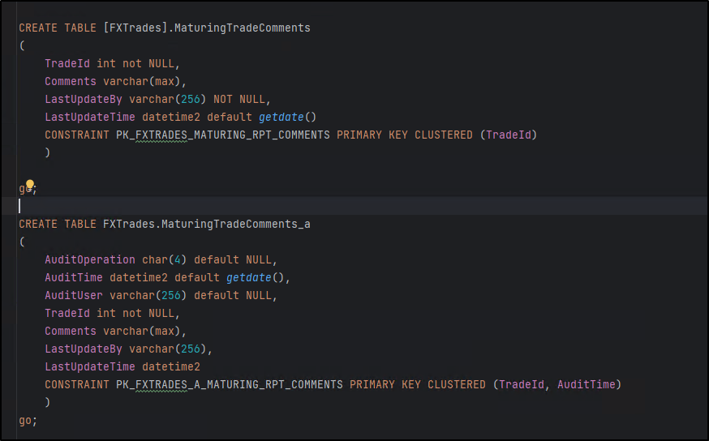
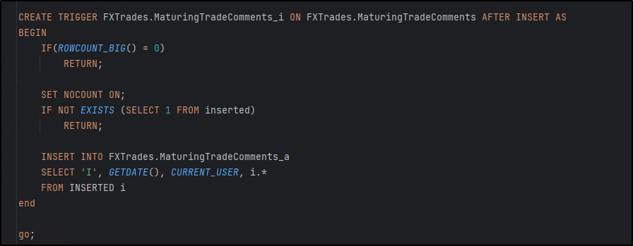
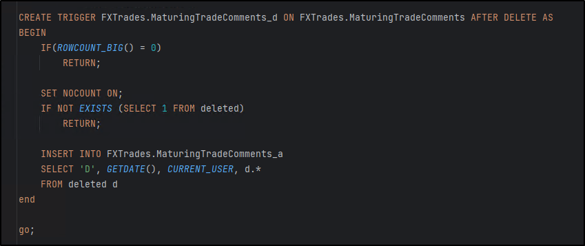
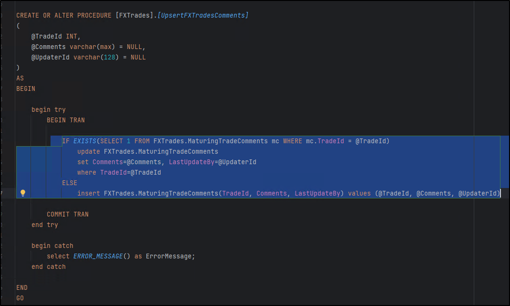
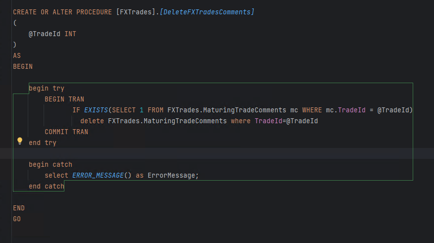

> Rounding

```
SELECT
  s.user_id,
  ROUND(SUM(CASE  --how to do rounding
    WHEN c.action = 'confirmed' THEN 1
    WHEN s.time_stamp IS NULL THEN 0.00
    ELSE 0
  END) / COUNT(*), 2) AS confirmation_rate
FROM signups s
LEFT JOIN confirmations c
  ON s.user_id = c.user_id
GROUP BY s.user_id
```







